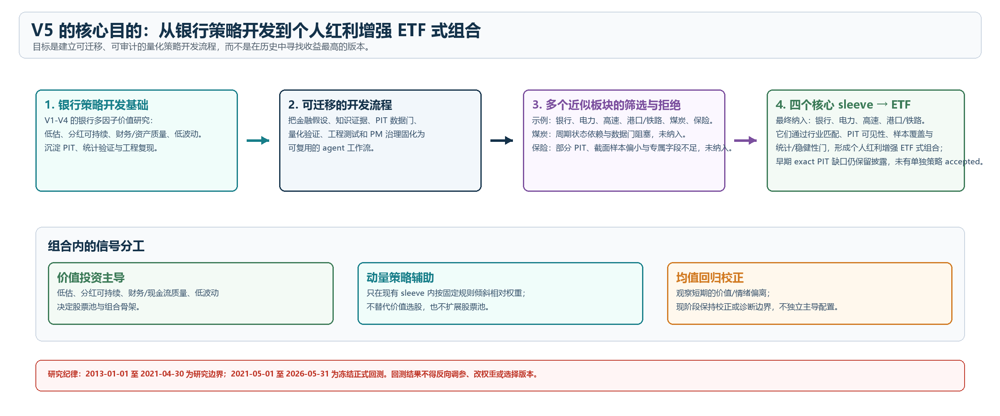
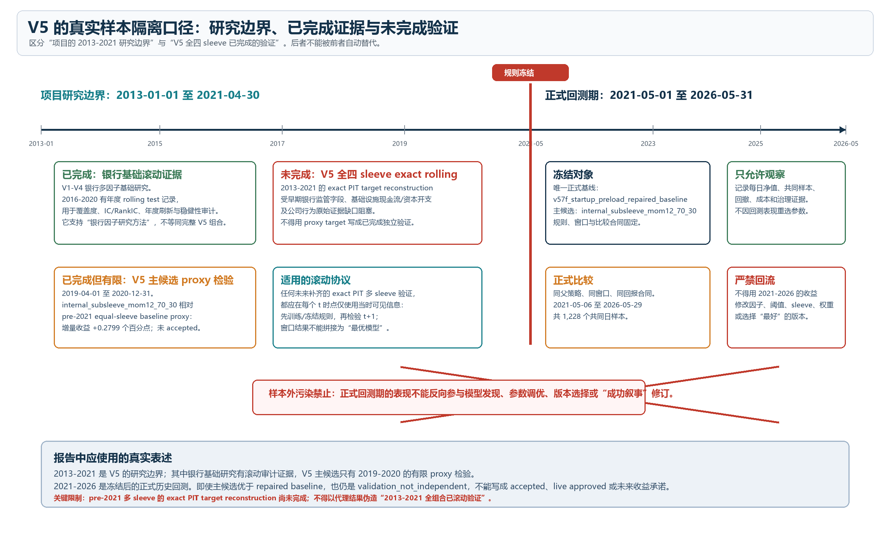
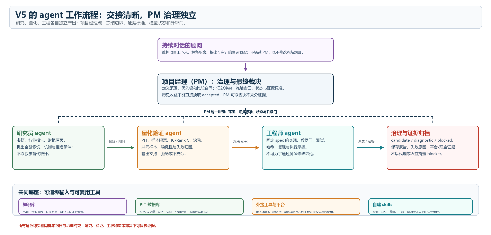
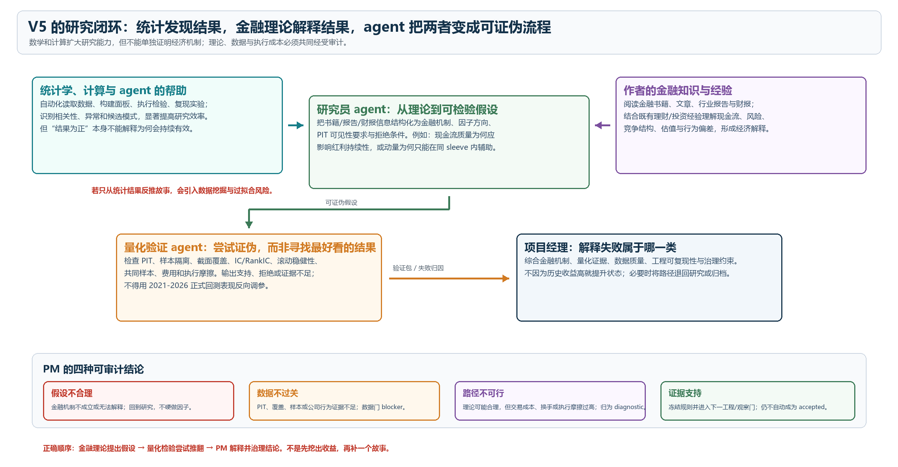
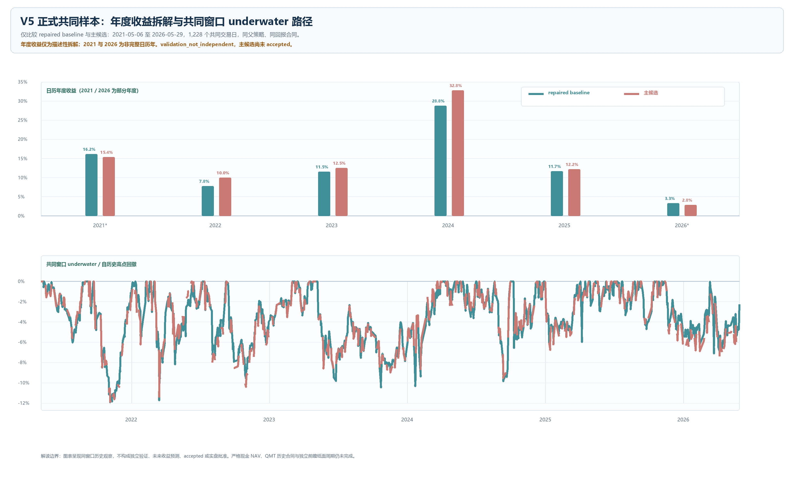

# V5 | Personal Quantitative Research Project

> 个人量化项目：从银行多因子价值策略到个人化红利增强 ETF 的研究与开发流程。

V5 is an auditable research workflow, not a live-trading system or a return-promotion project. It starts from the V1-V4 bank multi-factor value research line and asks a broader question:

> How can financial theory, point-in-time data, statistical validation, engineering constraints, and agent collaboration be combined into a repeatable quantitative research process?

The project transfers a bank-value research foundation to economically similar dividend-oriented sectors, records both successful and rejected research paths, and uses governance gates to prevent an attractive historical result from being treated as a deployable strategy.

## Project Snapshot

| Item | Frozen project fact |
|---|---|
| Formal baseline | `v57f_startup_preload_repaired_baseline` |
| Primary candidate | `internal_subsleeve_mom12_70_30` |
| Candidate status | `primary_forward_paper_candidate_not_accepted` |
| Formal backtest window | 2021-05-01 to 2026-05-31 |
| Formal common sample | 2021-05-06 to 2026-05-29, 1,228 trading days |
| Data boundary | No market data after 2026-05-31 is used for the formal report |

The only formal performance comparison in this repository is the same-parent, same-contract comparison between the repaired baseline and the primary candidate. It is a historical, **non-independent observation**, not an acceptance, deployment, or investment recommendation.

| Model | Total return | Annualized return | Maximum drawdown | Sharpe |
|---|---:|---:|---:|---:|
| Repaired baseline | 109.25% | 16.36% | 11.93% | 1.048 |
| Primary candidate: internal subsleeve momentum 70/30 | 120.69% | 17.64% | 11.88% | 1.115 |

The candidate's relative total-return observation is +11.43 percentage points in the formal common sample. This is not independent validation and does not change its `not_accepted` status.



## Project Formation and Author Resources

The focused development period ran from May to July 2026: the project direction formed during the author's May internship, V1-V4 bank strategy development took shape in June, and V5 expanded that foundation into a governed multi-sleeve research workflow in July. This timeline describes project formation, not model maturity or a performance claim.

The work combines public disclosures with author-paid or locally authorized historical market resources, including minute-level price, volume, and amount data. Books are accessed through the author's WeChat Reading membership; institutional reports and market articles include author-paid membership access. Collection is deliberately rate-limited and manually reviewed to respect platform terms and avoid account-restriction risk. Codex and GPT-5.5 are the primary AI collaborators for research decomposition, knowledge synthesis, implementation, and report organization; their output is never treated as evidence without source review, PIT-clean inputs, reproducible tests, and governance approval.

## Research Design

### 1. Build from an explained bank foundation

V1-V4 established the starting research line in Chinese bank equities: multi-factor value selection, dividend sustainability, financial quality, and low-volatility constraints. V5 does not assume that a rule which worked for banks transfers automatically. It requires a financial explanation, point-in-time evidence, statistical testing, and implementation feasibility for each sector-level hypothesis.

### 2. Use a constrained four-sleeve baseline

The repaired formal baseline contains four core sleeves:

- Banks
- Highway infrastructure
- Port and rail infrastructure
- Electricity and utilities

Value and low volatility remain the selection foundation. Momentum is permitted only as a fixed, internal sleeve-governance overlay; it does not replace the value-oriented stock pool. Mean-reversion, intraday, technical-analysis, cash, and execution research lines are retained as diagnostics or observations unless they meet their own evidence and governance gates.

### 3. Protect the time-series boundary

The project distinguishes early research evidence from the frozen formal backtest. The 2013-01-01 to 2021-04-30 period supports research and validation work, especially on the bank foundation. The full four-sleeve pre-2021 exact PIT reconstruction remains incomplete, so it is not described as completed independent validation.

The formal historical backtest begins on 2021-05-01. The first valid signal is 2021-05-06.



## Agent Workflow

V5 separates responsibilities so that a promising result must survive more than one kind of scrutiny.

```text
Financial theory and author intent
             |
             v
Research Agent: hypothesis, sector logic, evidence collection
             |
             v
Quant Agent: PIT checks, factor tests, ablation, robustness, attribution
             |
             v
Engineering Agent: data contracts, reproducible runners, execution constraints
             |
             v
Project Manager: scope control, evidence classification, promotion gate
```

The project also maintains a knowledge base, local research databases, experiment packets, governance records, and reusable skills. The advisor conversation is deliberately kept separate from deterministic runners: natural language frames the question; code and stored artifacts establish what actually happened.



## Data Sources and Contracts

V5 does not treat a data file as evidence merely because it exists locally. Every research input is assigned a permitted use, a visibility requirement, and an explicit failure mode. Large raw datasets, licensed files, PDFs, OCR output, platform logs, and temporary exports are intentionally kept out of the public repository unless a compact manifest is sufficient for reproducibility.

| Source family | Main contents | Used for | Contract and limitation |
|---|---|---|---|
| Original annual reports and exchange disclosures | Operating purity, cash flow, capex, dividend, financial quality, and sector-specific fields | PIT factor panels and sector-admission evidence | The reviewed document and visible date must precede the relevant rebalance date. Missing original evidence is a data gate, not a value filled from later reports. |
| JoinQuant local exports and platform output | Daily prices, corporate actions, fundamentals, platform result/position/transaction exports | Daily local simulation and platform-attribution research | Useful for alignment and attribution only. Historical QMT/JoinQuant target-order-fill-position-cash material is incomplete, so it cannot support exact historical execution claims. |
| BaoStock daily and five-minute data | A-share daily bars and five-minute diagnostic bars | Daily series checks, short-window price-path and intraday diagnostics | Five-minute research is an execution/diagnostic line. It is not used to raise trading frequency or to create an accepted standalone model. |
| Author-paid and locally authorized one-minute data | One-minute OHLCV, volume, and amount, cleaned into the local 2013-2026 minute panel | VWAP, pressure, intraday zone, and execution-path diagnostics | Historical market data includes author-paid resources and locally authorized files. The public repository contains manifests and quality reports rather than licensed raw files. One-minute data improves measurement precision; it does not by itself prove a tradable high-frequency edge. |
| Local adjustment-factor and corporate-action ledger | Ex-dividend, rights, restructuring, and major adjustment-factor changes | Total-return and PIT corporate-action audits | Unexplained material actions are kept as unresolved evidence, never silently accepted as a verified total-return chain. |
| ETF adjusted-price cache | Red-dividend ETF, low-volatility dividend ETF, and bank-index price context | Economic-exposure visual context only | Adjusted price return is **not** an ETF total-return contract. It is excluded from formal ETF alpha, beta, information-ratio, and excess-return calculations. |
| Author-accessed books, articles, and research reports | Value investing, sector operating logic, dividend and cash-flow interpretation | Hypothesis formation and research-agent knowledge base | Books are accessed through the author's WeChat Reading membership; institutional reports and market articles include author-paid membership access. Collection is rate-limited and manually reviewed to respect platform terms and account restrictions. Literature informs hypotheses; it does not substitute for PIT data or a statistical test. |

### Data Handling Rules

1. **Point-in-time first.** Financial statements, industry inclusion, dividends, and corporate actions must be known by the decision date.
2. **No proxy promotion.** A later annual report, a benchmark proxy, or a reconstructed target is not silently substituted for a missing historical source.
3. **Raw data stays local.** Licensed minute files, PDF/OCR workspaces, temporary platform exports, and account-related logs are manifested rather than published.
4. **Return contracts stay separate.** Strategy local daily returns, ETF adjusted-price context, platform exports, and strict cash NAV are different data products and cannot be mixed into one headline statistic.
5. **Every repair is traceable.** Source repair, corporate-action review, PIT exceptions, and generated reports are logged in governance and evidence artifacts.
6. **AI is a collaborator, not evidence.** Codex and GPT-5.5 help decompose tasks, synthesize knowledge, implement deterministic checks, and organize reports. Formal claims still require traceable sources, PIT-clean inputs, reproducible tests, and project-manager approval.

## Model and Research-Line Map

The repository contains many experiments. The table below is the useful map for a reader: it distinguishes a formal comparison model from research, execution, and governance units that must not be ranked together.

| Family | Representative artifact | Purpose | Current interpretation |
|---|---|---|---|
| V1-V4 bank foundation | Bank multi-factor value research | Establish value, dividend sustainability, financial quality, and low-volatility logic in banks | Foundation and methodological predecessor; not the V5 formal comparison baseline. |
| V57f repaired baseline | `v57f_startup_preload_repaired_baseline` | Four-sleeve value/low-volatility reference portfolio | The only formal baseline. Startup preload repair replaces the obsolete 2021-10 baseline chain. |
| V5f primary candidate | `internal_subsleeve_mom12_70_30` | Keep the value/low-vol stock pool, then use fixed 12-1 momentum governance inside each sleeve | The only primary forward/paper candidate. Formally comparable only with the repaired baseline. |
| V5c state, quality, and sector research | Financial-quality, valuation/crowding, OCF/capex, and industry-specific diagnostics | Test whether additional financial knowledge improves selection or risk handling | Diagnostics and data gates. No V5c line may enter the formal performance ranking without a separate approved contract. |
| V5d execution engineering | Five-minute data, order scheduling, slippage, partial-fill and rebalance-health work | Test operational feasibility and transaction-path assumptions | Engineering evidence, not a return model. |
| V5e exit and cash governance | Exit timing, cash buckets, cash proxy, partial-buy/skip policies | Make the cash path and order sequence explicit | Historical closure without promotion. Strict cash NAV remains unavailable. |
| V5g overlay governance | State-gated momentum, quality guard, risk budget, cash-policy specs | Test whether auxiliary overlays can be admitted safely | Secondary observation or data-gate work; not promoted over the V5f main line. |
| V5h minute microstructure | One-minute price, volume, amount, VWAP, pressure and liquidity segmentation | Improve execution diagnostics and buy-zone precision without higher turnover | Observation and execution research only. |
| V5i-V5j technical and cross-period work | Daily/one-minute price-volume sell rules, five-day minute families, PIT repairs | Test whether technical signals add stable execution value | Did not create a universally promotable rule; retained as diagnostic or engineering evidence. |
| V5k-V5m workflow repair | Active-model registry, test isolation, provenance, cash/QMT contract recovery | Turn research governance into a reproducible operating system | Workflow and evidence infrastructure, not a strategy. |
| V5n-V5w reporting and evidence | Model tiers, comparison contracts, publication review, report readiness | Stop incomparable models and sources from entering formal claims | Reporting governance; no model or statistic is changed here. |

## Development Lifecycle

The workflow is deliberately sequential. A model cannot jump from an interesting chart to paper trading because each stage produces an artifact that the next stage can challenge.

| Stage | Research question | Typical output | Stop or promotion rule |
|---|---|---|---|
| 1. Problem framing | What economic mechanism is being tested, and why might it exist in this sector? | Research brief, theory notes, hypothesis, expected failure modes | Reject or narrow hypotheses with no financial explanation. |
| 2. Data admission | Can the required fields be observed point-in-time, at sufficient coverage and with a usable source contract? | Source map, original-page review queue, PIT panel, missingness report | Missing source evidence becomes a data gate. No later-data backfill. |
| 3. Quant specification | What is fixed before the main test: universe, factors, weights, timing, return contract, and benchmark? | Versioned JSON/CSV specification and PM/Quant contract | No parameter sweep may masquerade as a new hypothesis. |
| 4. Statistical validation | Does the factor or rule survive baseline, ablation, IC/RankIC, rolling, robustness, and weak-year checks? | Formal validation packet and failure attribution | A positive result with unstable, overlapping, or insufficient evidence stays diagnostic. |
| 5. Engineering | Can the calculation, order sequence, availability checks, and logging be reproduced? | Deterministic runner, tests, local simulation, rebalance-order health | Engineering cannot upgrade a weak research claim. |
| 6. Platform attribution | Does a permitted platform implementation agree with the local contract closely enough to explain residuals? | Submitted-script snapshot, configuration, export checklist, daily attribution | Platform output is not accepted evidence without the relevant target/order/fill/position/cash contract. |
| 7. Forward/paper evidence | Can the frozen logic produce a complete future `target -> order -> fill -> position -> cash` record? | Paper ledger and periodic reconciliation | Only authorized forward evidence can support a later upgrade decision. |
| 8. PM gate and reporting | What was proven, what failed, and what remains blocked? | Status registry, tier assignment, claim-to-evidence map, report | Historical performance alone never changes a model to accepted. |



## What Was Learned

### Sector transfer is conditional, not automatic

The workflow was used to explore adjacent dividend-oriented sectors. Some paths became part of the repaired four-sleeve baseline; others stayed in observation or were blocked by missing state data, concentration, or unresolved financial interpretation. This is an intended outcome: the process should make rejection auditable rather than silently optimize around it.

### Theory, statistics, and engineering must agree

Financial interpretation generates hypotheses. Statistical work tries to falsify them. Engineering checks whether the data and execution path can support an honest implementation. A mechanism is not promoted merely because it improves one historical chart.

### Negative findings are research artifacts

The repository keeps mean-reversion, short-window reversal, intraday execution, technical-analysis, and sector-specific investigations as diagnostic or observation material when evidence is incomplete. They do not enter the formal strategy-performance ranking.

## Problems Encountered and How the Workflow Responded

V5 is most useful when it makes a problem visible before it becomes an unsupported conclusion. The following examples are intentionally retained in the repository rather than edited out.

| Problem | Why it mattered | Response | Resulting boundary |
|---|---|---|---|
| Old 2021-10 baseline chain conflicted with the intended startup state | A baseline mismatch invalidates every downstream comparison | Rebuilt the formal reference as `v57f_startup_preload_repaired_baseline` and excluded the old chain from formal reporting | Only the startup-preload repaired baseline is official. |
| Early research and 2021-2026 backtest risked being mixed | This creates time-series leakage and sample-out-of-sample contamination | Froze 2013-2021 as research/validation evidence and 2021-05-01 to 2026-05-31 as the formal historical window | Full four-sleeve pre-2021 exact PIT reconstruction remains incomplete and is disclosed as such. |
| Pre-2021 minute coverage was incomplete for some holdings | Short-window reversal or execution claims cannot be generalized from partial coverage | Added targeted one-minute source repair, cleaning, coverage checks, and security-year pairing | Minute findings remain execution diagnostics until independently supported. |
| Daily re-optimization of momentum created unnecessary turnover/noise | A 12-1 signal can have a lower information frequency than daily price changes | Tested schedule, rank-change, drift, monthly, and risk-warning governance variants | Fixed internal 70/30 sleeve momentum remains the only primary candidate; daily full re-optimization was not promoted. |
| Mean-reversion intuition did not translate into stable red-dividend evidence | “Cheap” or “oversold” can reflect persistent fundamentals or market structure rather than a repair trade | Tested quality filters, narrow windows, spike/reversal symmetry, and minute-path variants | Mean reversion remains diagnostic; it does not receive a permanent portfolio allocation. |
| A financial explanation did not guarantee a viable sector transfer | Similar-looking sectors can differ in regulation, cash-flow cycle, concentration, and data availability | Used business-purity evidence, specialist fields, state gates, and sector screening | Telecom, gas/water, insurance, coal and other paths are kept as observations, specialist research, or blockers rather than forced into the core basket. |
| Local and platform outputs did not automatically agree | Open-price approximations, tradability filters, whole-lot rules, timing, dividends, and logging can cause residuals | Added platform-attribution, submitted-script, export, and rebalance-order-health contracts | QMT historical contract is still incomplete; exact historical fill attribution is not claimed. |
| Adjustment-factor changes and corporate actions were not always self-explanatory | An unreviewed action can distort a total-return series | Created corporate-action ledger, original-notice review, and unclassified-action fallback paths | Unresolved actions remain explicit evidence gaps. |
| Historical target weights could not reconstruct exact cash | Returns alone cannot recover orders, cash residuals, fills, suspensions, and lot constraints | Introduced strict-cash-NAV and partial-buy/skip governance work | `strict_cash_nav_unavailable` remains a hard disclosure and blocks strong execution conclusions. |
| Large workspace growth made results hard to compare | Hundreds of runners and artifacts can accidentally mix diagnostic output with formal model performance | Added active-model registry, experiment catalog, test isolation, Tier A/B reporting rules, manifests, and SHA256 freeze records | Only canonical models with the same parent, window, and return contract may be compared. |

## Formal Comparison and Its Boundary



The figure above uses the canonical local daily series for the two permitted formal models only. Annual bars are descriptive; 2021 and 2026 are partial calendar years. ETF price series, when shown elsewhere in the project, are economic-exposure context only and are never used to calculate formal ETF alpha, beta, information ratio, or excess return.

## Current Governance State

The primary candidate remains a forward/paper candidate, not an accepted strategy. The following limitations are mandatory disclosures:

- `strict_cash_nav_unavailable`: historical target weights and return series cannot legally reconstruct the full cash state.
- `qmt_contract_incomplete`: historical QMT script, configuration, target, order, fill, position, and cash artifacts do not form a complete execution contract.
- ETF total-return contract missing: local ETF price series are context, not a formal total-return benchmark.
- `validation_not_independent`: the formal historical comparison is not an independent validation sample.
- An independent forward paper cycle has not yet formed.

These constraints do not invalidate an honest historical research report. They do block accepted/live language, precise execution attribution, and strong performance claims.

## Repository Guide

| Path | Purpose |
|---|---|
| [`src/v5/`](src/v5/) | Deterministic strategy, validation, backtest, audit, and workflow runners |
| [`tests/`](tests/) | Fast, standard, and extended reproducibility tests |
| [`config/`](config/) | Test-tier, active-model, and historical-operation contracts |
| [`docs/governance/`](docs/governance/) | Status registry, PM decisions, operating protocols, and evidence gates |
| [`knowledge/`](knowledge/) | Research-agent theory notes, source registers, and hypothesis material |
| [`数据库/`](数据库/) | Local raw and processed data boundary; credentials are never stored here |
| [`v5t_report_publication_finalization/`](v5t_report_publication_finalization/) | Frozen historical research and governance report v1.0 |
| [`v5x_personal_project_report/`](v5x_personal_project_report/) | Chinese personal-project report, narrative draft, source manifest, and visual QA |

## Reproduce the Governance Checks

The repository is intentionally organized around deterministic runners and recorded artifacts. Use a clean environment and run the tier selected in [`config/v5_test_tiers.json`](config/v5_test_tiers.json).

```powershell
$env:PYTHONPATH = "src"
python -m unittest tests.test_v5k_active_model_registry_runner
python -m unittest tests.test_v5t_report_publication_finalization_runner
python -m unittest tests.test_v5v_application_final_report_readiness_runner
```

The extended suite is deliberately separated because it can take longer than a normal development check. Historical and platform artifacts must never be silently regenerated with future data or substituted with proxy targets.

## Recommended Reading Order

1. [Historical Research and Governance Report v1.0](v5t_report_publication_finalization/current/v5t_v5_historical_research_and_governance_report_v1_0.md)
2. [Personal Quantitative Project Overview (Chinese)](v5x_personal_project_report/current/v5x_personal_quantitative_project_overview.md)
3. [Personal Quantitative Project Report](v5x_personal_project_report/current/v5x_personal_quantitative_project_report.md)
4. [Active Model Registry](docs/governance/status_registry.json)
5. [Final Report Preparation Plan](v5w_final_report_preparation/current/v5w_report_content_and_visual_plan.md)

## Safety and Data Notes

- This repository is for research, education, and reproducibility. It is not investment advice.
- No live order should be created from this repository without a separately authorized forward-paper and execution-evidence workflow.
- JoinQuant, QMT, BaoStock, and other platform/data integrations are treated as external dependencies with their own permission, contract, and provenance boundaries.
- Do not commit credentials, brokerage identifiers, or personally identifying data.

---

**V5's central result is a disciplined process:** explain the hypothesis, validate what can be validated, preserve what failed, and do not promote a model beyond its evidence.
