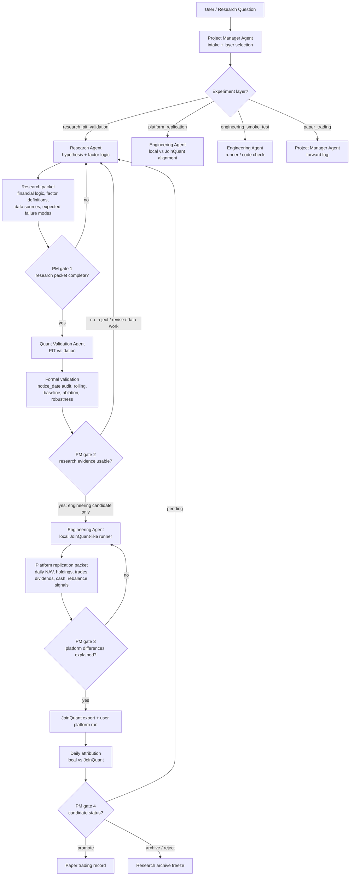
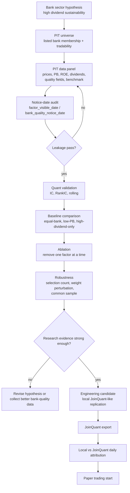

# Agent Collaboration and Bank Formal Validation Flow

Date: 2026-07-15

## Purpose

This document turns the V5 agent architecture into an execution flow for the next stage:

1. optimize agent collaboration;
2. complete formal bank-sector validation;
3. keep platform replication separate from research evidence;
4. prepare the process for later reuse on other sectors.

The immediate focus remains the bank sector. A new sector should only be tested after the bank flow can run end-to-end with clear handoffs, reproducible outputs, and Project Manager gates.

## A. Agent Collaboration Flow

## B. Responsibility Rules

| Agent | Owns | Must not do | Required output |
| --- | --- | --- | --- |
| Project Manager | layer selection, gates, decision log, sprint report | invent factor logic or tune parameters | task list, gate decision, archive / promote / pending status |
| Research Agent | financial explanation, factor hypothesis, source map | accept strategy because backtest is good | research proposal, factor spec, data-source request |
| Quant Validation Agent | PIT statistics, leakage audit, rolling, baseline, ablation, robustness | change investment story to fit returns | validation report, evidence table, failure-mode note |
| Engineering Agent | local runner, JoinQuant export, reproducibility, platform attribution | change research conclusion | runnable code, logs, local-vs-platform diagnostics |

Global rule:

> Every result must be tagged as `research_pit_validation`, `platform_replication`, `engineering_smoke_test`, or `paper_trading`. Project Manager Agent blocks any mixed interpretation.

## C. Bank-Sector Formal Validation Flow

## D. Execution Checklist

### Step 1: Project Manager gate

- Confirm experiment layer is `research_pit_validation`.
- Confirm the 2021-05 to 2026-05 window is not used for parameter tuning.
- Confirm the strategy has a frozen spec before validation.

Current target:

- `examples/bank_high_dividend_sustainability_v3_strategy.json`

### Step 2: Research Agent packet

Required research packet:

- bank value-investing framework;
- core bank-factor hypotheses;
- value-trap identification;
- defensive / macro-state variables as risk-control candidates only;
- source map for bank-specific indicators.

Current knowledge base:

- `knowledge/research_agent/factor_theory/bank_value_investing_framework.md`
- `knowledge/research_agent/factor_theory/bank_core_factor_hypotheses.md`
- `knowledge/research_agent/factor_theory/bank_value_trap_identification.md`
- `knowledge/research_agent/factor_theory/bank_defensive_macro_state_variables.md`

### Step 3: Quant Validation Agent formal run

Required tests:

- notice-date leakage audit;
- rolling validation;
- equal-bank baseline;
- low-PB baseline;
- current composite;
- leave-one-factor-out ablation;
- selection-count robustness;
- value-weight perturbation robustness;
- common-sample interaction tests.

Preferred PIT panel for current V3:

- `数据库/processed/joinquant_basic_pit_panel_v4_legacy_quality/panel.csv`

Expected output:

- `validation_formal/bank_high_dividend_sustainability_v3/`

Decision rule:

- Positive performance alone is insufficient.
- V3 can only move forward if the formal validation packet is complete and the leakage audit passes.
- V4 legacy quality fields remain `data_limited` until source dates are fully audited.

### Step 4: Engineering Agent platform replication

Required replication inputs:

- real daily open / close prices;
- 512800.XSHG benchmark prices;
- net cash dividends after tax;
- 100-share lot handling;
- commission and minimum commission;
- daily holdings, cash, trades, dividends, and rebalance logs.

Current input files:

- `数据库/processed/joinquant_real_daily_prices.csv`
- `数据库/processed/joinquant_real_benchmark_prices.csv`
- `数据库/processed/joinquant_cash_dividends.csv`

Expected output:

- `local_daily_backtests_v3_platform_replication/bank_high_dividend_sustainability_v3/`

### Step 5: JoinQuant comparison

After the user exports JoinQuant daily result CSV:

1. run platform attribution;
2. compare daily net value;
3. compare rebalance stock lists;
4. explain order, dividend, cash, benchmark, and price differences;
5. only then decide whether the local runner is trustworthy enough for routine testing.

### Step 6: Paper trading

Only after PM approval:

- freeze candidate spec;
- record future signal before execution;
- save visible data snapshot;
- never backfill decisions.

Output:

- `docs/governance/forward_paper_trading_log.md`

## E. What To Improve Next

Priority order:

1. finish local vs JoinQuant daily attribution;
2. audit V4 legacy bank-quality source dates;
3. expand bank-specific PIT quality data from reliable sources;
4. strengthen rolling validation and failure-mode reporting;
5. automate a standard phase report after every full validation run;
6. only then test a second sector such as utilities / public utilities.

## F. Reuse Rule For New Sectors

A new sector may start only when the bank-sector flow has these reusable assets:

- a complete research packet template;
- a PIT data contract;
- a formal validation runner output;
- a local platform replication output;
- a platform attribution output;
- a PM decision report.

The second sector should be used to test process portability, not to search for higher backtest returns.

## G. Execution Record: 2026-07-15

Current execution status:

| Step | Result | Output |
| --- | --- | --- |
| V3 strategy spec audit | pass | `examples/bank_high_dividend_sustainability_v3_strategy.json` |
| formal validation | completed, not acceptance | `validation_formal/bank_high_dividend_sustainability_v3/formal_validation_report.md` |
| notice-date leakage audit | pass | `missing_notice_date_rows = 0`, `future_notice_violations = 0` |
| local JoinQuant-like replication | completed as `platform_replication` | `local_daily_backtests_v3_platform_replication/bank_high_dividend_sustainability_v3/summary.json` |
| platform replication governance | first run blocked, second run passed | blocked until `eastmoney_visibility_mode=joinquant_source_year` was supplied |
| source compile check | pass | `python -m compileall -q src` |
| pytest suite | not run | local Python environment does not currently have `pytest` installed |

Latest local platform replication metrics:

| Metric | Value |
| --- | ---: |
| strategy_return | 65.36% |
| annualized_return | 10.87% |
| benchmark_return | 25.16% |
| excess_return | 40.20% |
| max_drawdown | 15.84% |
| signal_count | 19 |
| daily_count | 1228 |

Important interpretation:

- The formal validation result remains research evidence only.
- The platform replication result remains an engineering comparison output only.
- The positive local return is not an acceptance decision.
- The next required external input is the JoinQuant daily result CSV, so Engineering Agent can run daily attribution.

## H. JoinQuant Signal Alignment Update: 2026-07-15

User supplied three JoinQuant exports:

- `position.csv`
- `transaction.csv`
- `log.txt`

Engineering Agent used them to locate the local-vs-JoinQuant gap by layer.

Findings:

| Layer | Finding |
| --- | --- |
| Position layer | Initial local replication only matched 4 of 8 first-day holdings. |
| Transaction layer | Initial local replication only matched 4 of 8 first-day trades. |
| Signal log layer | JoinQuant logged `value trap guard degraded: missing quality fields; no guard applied.` |
| Local signal layer | Local replication had applied the value-trap guard and reduced first-day candidates from 40 to 18. |
| Dividend-yield layer | Local panel dividend yield used a different historical / adjusted-price basis than the JoinQuant V3 code. |

Fixes applied:

- added `--value-trap-guard-mode apply|disabled`;
- added `--signal-dividend-yield-mode panel|cash_dividend_trailing`;
- aligned weighted composite scoring with JoinQuant export:
  - winsorize before z-score;
  - support `min_factor_count`;
  - V3 spec explicitly sets `min_factor_count = 3`;
- kept formal research validation separate from platform replication behavior.

Post-fix alignment result:

| Check | Before | After |
| --- | ---: | ---: |
| First-day selected stocks matched | 4 / 8 | 8 / 8 |
| Transaction matched keys | 98 | 215 |
| JoinQuant-only transaction keys | 134 | 17 |
| Local-only transaction keys | 107 | 5 |
| Signal set-match dates | not aligned | 17 of 19 matched local dates |

Remaining gaps:

- local still uses daily open approximation while JoinQuant executes at 09:40 market price;
- candidate counts still differ on all dates, meaning local tradability / valid-data filtering is not identical to JoinQuant;
- three rebalance dates still have small selection-set mismatch;
- full NAV attribution still needs JoinQuant daily return / net-value CSV.
