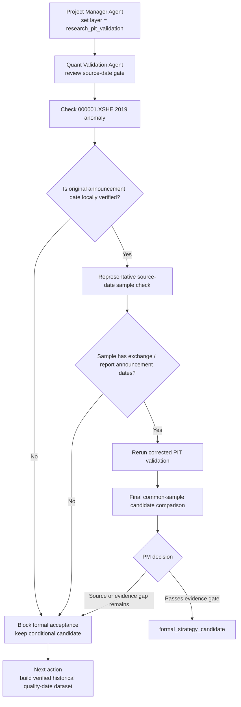

# Bank High Dividend Sustainability V3 - Conditional Candidate Closure

Date: 2026-07-15

Experiment layer:

`research_pit_validation`

## 1. Purpose

This note closes the current V3 conditional-candidate gate. It does not accept the strategy. It checks whether the remaining source-date issue and final common-sample evidence are strong enough to upgrade V3 from:

`conditional_research_candidate`

to:

`formal_strategy_candidate`

## 2. Closure Flow



## 3. Execution Result

### 3.1 `000001.XSHE` 2019 anomaly

Local V4 panel row inspected:

| Item | Result |
| --- | --- |
| code | `000001.XSHE` |
| source year | `2019` |
| first visible rebalance date in V4 panel | `2020-11-02` |
| non-performing loan rate | `1.65` |
| provision coverage | `183.12` |
| core tier 1 capital adequacy ratio | `9.11` |

Interpretation:

- The row exists in `D:\hh\codex\v4\phase_1_fundamental\phase1_training_panel.csv`.
- The date `2020-11-02` is a V4 panel visibility / rebalance bridge date.
- It is not proven to be the original annual-report announcement date.
- The row is later than the expected annual-report visibility window used by the audit.

Decision:

`000001.XSHE` 2019 remains `needs_source_review`.

### 3.2 V4 legacy quality source-date sample check

The audit packet contains:

| Audit Status | Count |
| --- | ---: |
| `plausible_bridge_date` | 309 |
| `needs_source_review` | 1 |

Representative codes reviewed from the audit table:

| Code | Local audit coverage | Status |
| --- | --- | --- |
| `000001.XSHE` | 2019-2023 | one 2019 anomaly, later rows plausible bridge dates |
| `002807.XSHE` | 2016-2023 | plausible bridge dates |
| `600036.XSHG` | 2013-2023 | plausible bridge dates |
| `600928.XSHG` | 2019-2023 | plausible bridge dates |
| `601009.XSHG` | 2013-2023 | plausible bridge dates |
| `601077.XSHG` | 2019-2023 | plausible bridge dates |
| `601166.XSHG` | 2013-2023 | plausible bridge dates |
| `601288.XSHG` | 2013-2023 | plausible bridge dates |
| `601398.XSHG` | 2013-2023 | plausible bridge dates |

Important limitation:

`D:\hh\codex\v4\phase_1_fundamental\eastmoney_bank_indicator_extracted_values.csv` currently contains original Eastmoney PDF extraction records only for report years `2024` and `2025`. It does not contain `000001.XSHE` 2019 original report-date evidence.

Therefore the local workspace can verify that the V4 bridge dates are mostly plausible, but it cannot independently verify historical original announcement dates for the long-sample quality fields.

### 3.3 Final common-sample candidate comparison

Source:

`validation_formal/bank_high_dividend_sustainability_v3/common_sample_interaction_tests.csv`

All cases use the same required common fields:

`dividend_yield; return_on_equity_ttm; low_price_to_book; provision_coverage_ratio; core_tier_1_capital_adequacy_ratio`

Common sample:

| Item | Result |
| --- | ---: |
| rows | 1365 |
| dates | 47 |
| securities | 41 |

Sorted by cumulative return:

| Case | Periods | Cumulative Return | Positive Ratio | Status |
| --- | ---: | ---: | ---: | --- |
| `common_high_dividend_all_support` | 47 | 3.6101 | 61.70% | completed |
| `common_high_dividend_only` | 47 | 3.3723 | 59.57% | completed |
| `common_high_dividend_plus_low_pb` | 47 | 3.2373 | 63.83% | completed |
| `common_high_dividend_plus_provision` | 47 | 3.1921 | 61.70% | completed |
| `common_high_dividend_plus_roe` | 47 | 3.1376 | 65.96% | completed |
| `common_high_dividend_plus_provision_capital` | 47 | 3.1344 | 59.57% | completed |
| `common_high_dividend_plus_capital` | 47 | 3.0947 | 57.45% | completed |

Interpretation:

- The full V3 sustainability composite is best on the common sample.
- The improvement over high-dividend-only is positive, but not large enough to override the source-date limitation.
- Quality variables should remain research-support variables, not accepted production alpha evidence, until historical original announcement dates are verified.

### 3.4 IC / RankIC reminder

Source:

`validation_formal/bank_high_dividend_sustainability_v3/factor_ic_rankic.csv`

| Factor | Mean IC | Mean RankIC | Positive IC Ratio |
| --- | ---: | ---: | ---: |
| `dividend_yield` | 0.1731 | 0.1735 | 77.55% |
| `low_price_to_book` | 0.1109 | 0.1168 | 61.22% |
| `provision_coverage_ratio` | 0.0924 | 0.0459 | 63.83% |
| `return_on_equity_ttm` | 0.0567 | 0.0412 | 57.14% |
| `core_tier_1_capital_adequacy_ratio` | -0.0003 | 0.0225 | 44.68% |

Interpretation:

- Dividend yield remains the primary research signal.
- Low PB remains the strongest supporting valuation baseline.
- Provision coverage is directionally useful but weaker.
- Core tier 1 capital should be treated as quality / risk context, not proven alpha.

## 4. PM Decision

Decision:

```text
status = conditional_research_candidate
not_status = formal_strategy_candidate
not_status = accepted_strategy
```

Reason:

- The common-sample evidence supports continuing V3 research.
- The formal validation packet contains useful IC / RankIC, baseline, ablation, robustness, and weak-year evidence.
- The remaining source-date gap is still material because V3 uses historical bank-quality fields from V4.
- The local Eastmoney extraction file does not currently verify original historical announcement dates for the 2013-2023 quality panel.

## 5. Required Next Work

The next work should not be more parameter tuning. It should be data-lineage repair:

1. Build a historical bank-quality source-date dataset from original annual report / exchange announcement dates for 2013-2023.
2. Re-check `000001.XSHE` 2019 against the original annual report announcement.
3. Replace V4 bridge dates with verified original source dates where available.
4. Rerun formal validation on the corrected PIT panel.
5. Only then reopen the PM decision gate for `formal_strategy_candidate`.

## 6. Agent Assignment

| Agent | Next Responsibility |
| --- | --- |
| Project Manager Agent | keep V3 blocked at conditional candidate; prevent acceptance based on platform or common-sample returns alone |
| Research Agent | define which bank-quality fields are essential enough to justify historical source-date collection |
| Quant Validation Agent | rerun leakage, IC / RankIC, ablation, baseline, robustness after source-date repair |
| Engineering Agent | build a reusable historical source-date collector and verifier runner |

