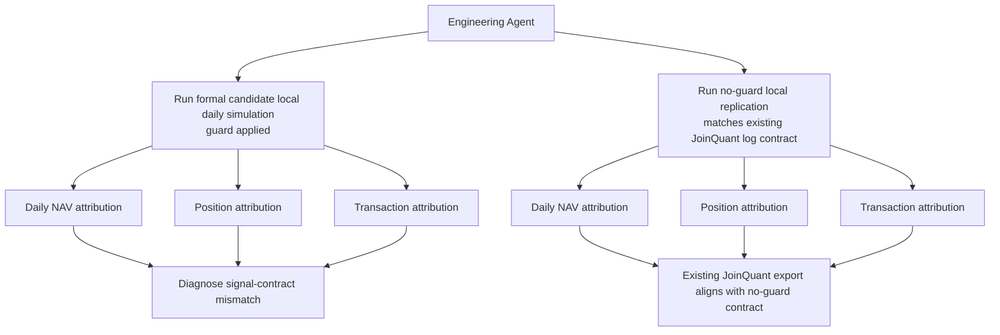

# Bank High Dividend Sustainability V3 - Engineering Replication

Date: 2026-07-16

Experiment layer:

`platform_replication`

## 1. Purpose

Engineering Agent ran local daily JoinQuant-like simulation and platform attribution for the V3 formal strategy candidate.

This is engineering evidence only. It must not be used as research validation or parameter tuning evidence.

## 2. Inputs

Formal candidate spec:

```text
examples/bank_high_dividend_sustainability_v3_strategy.json
```

PIT panel:

```text
数据库/processed/joinquant_basic_pit_panel_v4_legacy_quality/panel.csv
```

Execution data:

```text
数据库/processed/joinquant_real_daily_prices.csv
数据库/processed/joinquant_real_benchmark_prices.csv
数据库/processed/joinquant_cash_dividends.csv
```

JoinQuant exports used for attribution:

```text
C:/Users/Administrator/Downloads/result_1 (15).csv
C:/Users/Administrator/AppData/Local/Temp/position.csv
C:/Users/Administrator/AppData/Local/Temp/transaction.csv
C:/Users/Administrator/AppData/Local/Temp/log.txt
```

## 3. Flow



## 4. Formal Candidate Local Simulation

Command profile:

```text
python -m v5.cli daily-backtest examples\bank_high_dividend_sustainability_v3_strategy.json 数据库\processed\joinquant_basic_pit_panel_v4_legacy_quality\panel.csv --out local_daily_backtests_v3_formal_candidate --execution-price-csv 数据库\processed\joinquant_real_daily_prices.csv --benchmark-csv 数据库\processed\joinquant_real_benchmark_prices.csv --benchmark-id 512800.XSHG --dividend-cash-csv 数据库\processed\joinquant_cash_dividends.csv --experiment-layer platform_replication --eastmoney-visibility-mode joinquant_source_year --signal-dividend-yield-mode cash_dividend_trailing --value-trap-guard-mode apply --start-date 2021-05-01 --end-date 2026-05-31 --initial-cash 2000000 --target-exposure 0.995
```

Output:

```text
local_daily_backtests_v3_formal_candidate/bank_high_dividend_sustainability_v3/
```

Key metrics:

| Metric | Local Formal Candidate |
| --- | ---: |
| strategy return | 61.76% |
| annualized return | 10.37% |
| benchmark return | 25.16% |
| excess return | 36.60% |
| max drawdown | 17.24% |
| Sharpe | 0.686 |
| trade count | 192 |
| dividend events | 39 |
| rebalance count | 19 |

## 5. Attribution Against Existing JoinQuant Export

Daily attribution output:

```text
platform_attribution_v3_formal_candidate/bank_high_dividend_sustainability_v3/
```

Position attribution output:

```text
platform_attribution_v3_formal_candidate_positions/bank_high_dividend_sustainability_v3_positions/
```

Transaction attribution output:

```text
platform_attribution_v3_formal_candidate_transactions/bank_high_dividend_sustainability_v3_transactions/
```

Result:

| Check | Result |
| --- | ---: |
| matched days | 1228 |
| final strategy diff | -3.43 pct points |
| max absolute strategy diff | 12.38 pct points |
| first-day common position count | 5 / 8 |
| first-day JoinQuant-only stocks | `601166.XSHG;601288.XSHG;601988.XSHG` |
| first-day local-only stocks | `002966.XSHE;601838.XSHG;603323.XSHG` |
| matched transaction keys | 103 |
| JoinQuant-only transaction keys | 129 |
| local-only transaction keys | 88 |

Interpretation:

The existing JoinQuant export does not share the formal candidate's signal contract. The first rebalance already has a 3-stock mismatch. Therefore the existing JoinQuant export cannot be used as strict platform replication for the guard-applied formal candidate.

## 6. No-Guard Replication Check

Reason:

The existing JoinQuant log contains:

```text
V3 value trap guard degraded: missing quality fields; no guard applied.
```

Therefore Engineering Agent reran local replication with the guard disabled to match the existing JoinQuant log contract.

Output:

```text
local_daily_backtests_v3_formal_candidate_no_guard_replication/bank_high_dividend_sustainability_v3/
```

Key metrics:

| Metric | Local No-Guard Replication |
| --- | ---: |
| strategy return | 71.07% |
| annualized return | 11.65% |
| benchmark return | 25.16% |
| excess return | 45.91% |
| max drawdown | 14.19% |
| Sharpe | 0.801 |
| trade count | 221 |
| dividend events | 28 |
| rebalance count | 19 |

Attribution output:

```text
platform_attribution_v3_formal_candidate_no_guard/
platform_attribution_v3_formal_candidate_no_guard_positions/
platform_attribution_v3_formal_candidate_no_guard_transactions/
```

Result:

| Check | Result |
| --- | ---: |
| matched days | 1228 |
| final strategy diff | +5.88 pct points |
| max absolute strategy diff | 9.74 pct points |
| first-day common position count | 8 / 8 |
| first-day JoinQuant-only stocks | 0 |
| first-day local-only stocks | 0 |
| matched transaction keys | 215 |
| JoinQuant-only transaction keys | 17 |
| local-only transaction keys | 5 |

Interpretation:

The existing JoinQuant export matches the no-guard signal contract much better. First-day selected stocks are identical, and transaction matching improves materially. Remaining differences are likely execution details, intraday 09:40 price versus local daily-open approximation, cash/rounding, and later-date small signal or tradability differences.

## 7. Engineering Decision

Decision:

```text
formal_candidate_local_daily_simulation = completed
old_joinquant_export_replication = no_guard_contract
fresh_formal_candidate_joinquant_run = completed_by_user_summary
formal_candidate_joinquant_attribution = pending_fresh_exports
```

The formal candidate simulation is complete locally. The old JoinQuant exports are not a strict replication target for the formal candidate because the old JoinQuant run did not apply the value-trap guard.

After the JoinQuant script was changed to fail closed when the value-trap guard cannot be applied, the user reran the fresh guard-applied formal-candidate script in JoinQuant. The run placed orders normally and produced a platform summary close to the local formal-candidate simulation.

Fresh JoinQuant formal-candidate summary reported by user:

| Metric | Fresh JoinQuant Formal Candidate | Local Formal Candidate | Difference |
| --- | ---: | ---: | ---: |
| strategy return | 57.35% | 61.76% | -4.41 pct points |
| annualized return | 9.67% | 10.37% | -0.70 pct points |
| benchmark return | 26.51% | 25.16% | +1.35 pct points |
| excess return | 24.38% | 36.60% | -12.22 pct points |
| max drawdown | 17.06% | 17.24% | -0.18 pct points |
| beta | 0.864 | 0.863 | +0.001 |
| strategy volatility | 0.163 | 0.163 | +0.000 |
| benchmark volatility | 0.168 | 0.169 | -0.001 |
| max drawdown interval | 2021/07/07,2022/10/31 | 2021-07-07,2022-10-31 | aligned |

Interpretation:

- The fresh JoinQuant result is now directionally aligned with the local formal-candidate run.
- Risk path is very close: max drawdown, drawdown interval, beta, and volatility are all near local simulation.
- Strategy final return is lower on JoinQuant by 4.41 percentage points; this is plausible but still requires daily attribution.
- Excess return differs more because benchmark return differs by 1.35 percentage points and JoinQuant reports excess on its platform convention.
- This run supports "engineering smoke passed" for the guard-applied script. Fresh daily-result attribution has now been completed, while strict platform replication remains pending until fresh position, transaction, and log exports are attributed.

## 8. Fresh Daily Attribution

Fresh JoinQuant daily result export:

```text
C:/Users/Administrator/Downloads/result_1 (16).csv
```

Attribution output:

```text
platform_attribution_v3_formal_candidate_fresh/bank_high_dividend_sustainability_v3/
```

Result:

| Check | Result |
| --- | ---: |
| matched days | 1228 |
| final strategy diff | +4.41 pct points |
| final benchmark diff | -1.35 pct points |
| max absolute strategy diff | 7.19 pct points |
| max absolute benchmark diff | 1.62 pct points |
| local trade count | 192 |
| local dividend event count | 39 |
| local rebalance count | 19 |

Interpretation:

- Daily NAV attribution confirms the fresh JoinQuant run and local formal-candidate run are now materially aligned.
- Most of 2021-2025 shows a strategy-return difference around 0.5 to 1.6 percentage points at rebalance checkpoints.
- The largest divergence appears in 2026-04 to 2026-05. The maximum strategy difference occurs on 2026-05-11 at 7.19 percentage points and narrows to 4.41 percentage points by 2026-05-29.
- The remaining gap likely comes from execution timing, platform cash/dividend handling, or order/position differences near the final 2026 rebalances.
- The temporary position, transaction, and log files available locally were older than `result_1 (16).csv` and still reflected the old run, so they were not used for fresh formal-candidate attribution.

## 9. Fresh Transaction Attribution

Fresh JoinQuant transaction export:

```text
C:/Users/Administrator/AppData/Local/Temp/transaction (1).csv
```

Attribution output:

```text
platform_attribution_v3_formal_candidate_fresh_transactions/bank_high_dividend_sustainability_v3_transactions_transactions/
```

Result:

| Check | Result |
| --- | ---: |
| JoinQuant transaction rows | 206 |
| local transaction rows | 191 |
| matched transaction keys | 189 |
| JoinQuant-only keys | 17 |
| local-only keys | 2 |
| first-day common position count | 8 / 8 |
| first-day absolute amount difference | 1,700 shares |
| first-day absolute value difference | 3,441 |
| first-day absolute commission difference | 1.03 |

First-day selected stocks are fully aligned:

```text
002966.XSHE;600928.XSHG;601009.XSHG;601077.XSHG;601128.XSHG;601838.XSHG;601997.XSHG;603323.XSHG
```

Diagnosis:

- Fresh transaction attribution confirms the formal-candidate signal contract is now aligned at the first rebalance.
- The remaining return gap is not caused by the old no-guard signal mismatch.
- A major local-replication issue was found: the local PIT panel used in this run ends at `2026-01-05`, so local daily simulation has no `2026-04-01` rebalance signal.
- JoinQuant has 10 transactions on `2026-04-01`, including sells in `601838.XSHG`, `000001.XSHE`, small trims, and buys in `600036.XSHG` and `601825.XSHG`.
- This explains why daily NAV divergence grows in `2026-04` to `2026-05`.
- Therefore the current local-vs-JoinQuant gap should not be treated as platform execution mismatch until the local PIT panel is extended through `2026-04-01`.

## 10. Extended Local PIT Panel Rerun

Engineering Agent extended the local scaffold and rebuilt the JoinQuant PIT panel through the `2026-04-01` rebalance:

```text
data/processed/bank_value_15y_extended_202604/panel.csv
数据库/processed/joinquant_basic_pit_panel_v4_legacy_quality_extended_202604/panel.csv
```

The extended PIT panel now contains:

| Check | Result |
| --- | ---: |
| 2026-04-01 panel rows | 42 |
| local rebalance signals | 20 |
| 2026-04-01 candidate count | 42 |
| 2026-04-01 guarded count | 21 |
| 2026-04-01 selected count | 8 |

Local extended daily simulation:

```text
local_daily_backtests_v3_formal_candidate_extended_202604/bank_high_dividend_sustainability_v3/
```

Key metrics after extension:

| Metric | Extended Local | Fresh JoinQuant | Difference |
| --- | ---: | ---: | ---: |
| strategy return | 57.94% | 57.35% | +0.59 pct points |
| annualized return | 9.83% | 9.67% | +0.16 pct points |
| benchmark return | 25.16% | 26.51% | -1.35 pct points |
| max drawdown | 17.24% | 17.06% | +0.18 pct points |
| beta | 0.864 | 0.864 | aligned |
| strategy volatility | 0.163 | 0.163 | aligned |
| max drawdown interval | 2021-07-07,2022-10-31 | 2021/07/07,2022/10/31 | aligned |

Fresh daily attribution after extension:

```text
platform_attribution_v3_formal_candidate_extended_202604/bank_high_dividend_sustainability_v3/
```

| Check | Before Extension | After Extension |
| --- | ---: | ---: |
| matched days | 1228 | 1228 |
| final strategy diff | +4.41 pct points | +0.59 pct points |
| max absolute strategy diff | 7.19 pct points | 2.52 pct points |
| final benchmark diff | -1.35 pct points | -1.35 pct points |
| local rebalance count | 19 | 20 |
| local trade count | 192 | 201 |

Fresh transaction attribution after extension:

```text
platform_attribution_v3_formal_candidate_extended_202604_transactions/bank_high_dividend_sustainability_v3_transactions_transactions/
```

| Check | Before Extension | After Extension |
| --- | ---: | ---: |
| JoinQuant transaction rows | 206 | 206 |
| local transaction rows | 191 | 200 |
| matched transaction keys | 189 | 198 |
| JoinQuant-only keys | 17 | 8 |
| local-only keys | 2 | 2 |
| JoinQuant transaction dates | 20 | 20 |
| local transaction dates | 19 | 20 |

Interpretation:

- The missing `2026-04-01` local signal was the main cause of the previous 2026-04 to 2026-05 divergence.
- After adding the missing PIT date, strategy return difference narrows from 4.41 percentage points to 0.59 percentage points.
- Remaining differences are now plausibly due to execution timing (`09:40` versus local daily-open approximation), hundred-share rounding, tiny order differences, cash/dividend timing, and benchmark price convention.
- The benchmark difference remains unchanged because it comes from the local benchmark series versus JoinQuant platform benchmark convention, not from the strategy signal.

## 11. Fresh Position Attribution After Extension

Fresh JoinQuant position export:

```text
C:/Users/Administrator/AppData/Local/Temp/position (1).csv
```

Attribution output:

```text
platform_attribution_v3_formal_candidate_extended_202604_positions/bank_high_dividend_sustainability_v3_positions_positions/
```

Raw position export note:

- JoinQuant position export is daily.
- Local `holdings.csv` is recorded on rebalance dates only.
- Therefore daily non-rebalance rows in the JoinQuant export are not strict mismatch evidence. The relevant platform-replication check is the overlap on local rebalance dates.

Result on the 20 local rebalance dates:

| Check | Result |
| --- | ---: |
| local rebalance dates checked | 20 |
| dates with code mismatch | 0 |
| first-day common position count | 8 / 8 |
| 2026-04-01 common position count | 8 / 8 |
| max absolute share difference by date | 6,800 shares |
| max absolute weight difference by date | 1.26 pct points |
| total absolute weight difference across 20 dates | 9.44 pct points |

Key rebalance-date examples:

| Date | JoinQuant Count | Local Count | Common | Only JoinQuant | Only Local | Abs Share Diff | Abs Weight Diff |
| --- | ---: | ---: | ---: | ---: | ---: | ---: | ---: |
| 2021-07-01 | 8 | 8 | 8 | 0 | 0 | 1,700 | 0.58 pct points |
| 2026-04-01 | 8 | 8 | 8 | 0 | 0 | 6,800 | 0.30 pct points |

Interpretation:

- Position attribution confirms the selected-stock contract is aligned on every local rebalance date.
- Remaining position differences are small share-count and weight residuals, consistent with `09:40` execution prices versus local daily-open approximation, hundred-share rounding, cash drift, and tiny order differences.
- Together with daily NAV and transaction attribution, this supports marking V3 formal candidate platform replication as passed with documented minor residuals, pending only log-file archival if desired.

## 12. Next Engineering Action

Optional final archival step:

- log TXT containing value-trap guard application lines.

Project Manager Agent can mark V3 formal candidate platform replication as passed with minor expected execution/benchmark residuals.
