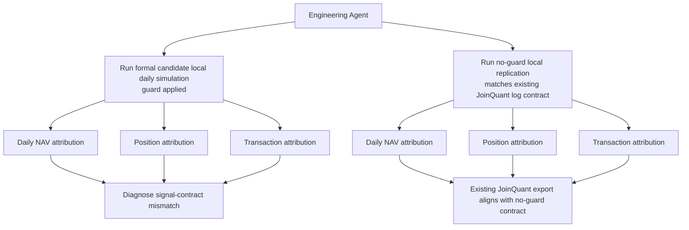

# Bank High Dividend Sustainability V3 - Engineering Replication

Date: 2026-07-16

Experiment layer:

`platform_replication`

## 1. Purpose

Engineering Agent ran local daily JoinQuant-like simulation and platform attribution for the V3 formal strategy candidate.

This is engineering evidence only. It must not be used as research validation or parameter tuning evidence.

## 2. Inputs

Formal candidate spec:

```text
examples/bank_high_dividend_sustainability_v3_strategy.json
```

PIT panel:

```text
数据库/processed/joinquant_basic_pit_panel_v4_legacy_quality/panel.csv
```

Execution data:

```text
数据库/processed/joinquant_real_daily_prices.csv
数据库/processed/joinquant_real_benchmark_prices.csv
数据库/processed/joinquant_cash_dividends.csv
```

JoinQuant exports used for attribution:

```text
C:/Users/Administrator/Downloads/result_1 (15).csv
C:/Users/Administrator/AppData/Local/Temp/position.csv
C:/Users/Administrator/AppData/Local/Temp/transaction.csv
C:/Users/Administrator/AppData/Local/Temp/log.txt
```

## 3. Flow



## 4. Formal Candidate Local Simulation

Command profile:

```text
python -m v5.cli daily-backtest examples\bank_high_dividend_sustainability_v3_strategy.json 数据库\processed\joinquant_basic_pit_panel_v4_legacy_quality\panel.csv --out local_daily_backtests_v3_formal_candidate --execution-price-csv 数据库\processed\joinquant_real_daily_prices.csv --benchmark-csv 数据库\processed\joinquant_real_benchmark_prices.csv --benchmark-id 512800.XSHG --dividend-cash-csv 数据库\processed\joinquant_cash_dividends.csv --experiment-layer platform_replication --eastmoney-visibility-mode joinquant_source_year --signal-dividend-yield-mode cash_dividend_trailing --value-trap-guard-mode apply --start-date 2021-05-01 --end-date 2026-05-31 --initial-cash 2000000 --target-exposure 0.995
```

Output:

```text
local_daily_backtests_v3_formal_candidate/bank_high_dividend_sustainability_v3/
```

Key metrics:

| Metric | Local Formal Candidate |
| --- | ---: |
| strategy return | 61.76% |
| annualized return | 10.37% |
| benchmark return | 25.16% |
| excess return | 36.60% |
| max drawdown | 17.24% |
| Sharpe | 0.686 |
| trade count | 192 |
| dividend events | 39 |
| rebalance count | 19 |

## 5. Attribution Against Existing JoinQuant Export

Daily attribution output:

```text
platform_attribution_v3_formal_candidate/bank_high_dividend_sustainability_v3/
```

Position attribution output:

```text
platform_attribution_v3_formal_candidate_positions/bank_high_dividend_sustainability_v3_positions/
```

Transaction attribution output:

```text
platform_attribution_v3_formal_candidate_transactions/bank_high_dividend_sustainability_v3_transactions/
```

Result:

| Check | Result |
| --- | ---: |
| matched days | 1228 |
| final strategy diff | -3.43 pct points |
| max absolute strategy diff | 12.38 pct points |
| first-day common position count | 5 / 8 |
| first-day JoinQuant-only stocks | `601166.XSHG;601288.XSHG;601988.XSHG` |
| first-day local-only stocks | `002966.XSHE;601838.XSHG;603323.XSHG` |
| matched transaction keys | 103 |
| JoinQuant-only transaction keys | 129 |
| local-only transaction keys | 88 |

Interpretation:

The existing JoinQuant export does not share the formal candidate's signal contract. The first rebalance already has a 3-stock mismatch. Therefore the existing JoinQuant export cannot be used as strict platform replication for the guard-applied formal candidate.

## 6. No-Guard Replication Check

Reason:

The existing JoinQuant log contains:

```text
V3 value trap guard degraded: missing quality fields; no guard applied.
```

Therefore Engineering Agent reran local replication with the guard disabled to match the existing JoinQuant log contract.

Output:

```text
local_daily_backtests_v3_formal_candidate_no_guard_replication/bank_high_dividend_sustainability_v3/
```

Key metrics:

| Metric | Local No-Guard Replication |
| --- | ---: |
| strategy return | 71.07% |
| annualized return | 11.65% |
| benchmark return | 25.16% |
| excess return | 45.91% |
| max drawdown | 14.19% |
| Sharpe | 0.801 |
| trade count | 221 |
| dividend events | 28 |
| rebalance count | 19 |

Attribution output:

```text
platform_attribution_v3_formal_candidate_no_guard/
platform_attribution_v3_formal_candidate_no_guard_positions/
platform_attribution_v3_formal_candidate_no_guard_transactions/
```

Result:

| Check | Result |
| --- | ---: |
| matched days | 1228 |
| final strategy diff | +5.88 pct points |
| max absolute strategy diff | 9.74 pct points |
| first-day common position count | 8 / 8 |
| first-day JoinQuant-only stocks | 0 |
| first-day local-only stocks | 0 |
| matched transaction keys | 215 |
| JoinQuant-only transaction keys | 17 |
| local-only transaction keys | 5 |

Interpretation:

The existing JoinQuant export matches the no-guard signal contract much better. First-day selected stocks are identical, and transaction matching improves materially. Remaining differences are likely execution details, intraday 09:40 price versus local daily-open approximation, cash/rounding, and later-date small signal or tradability differences.

## 7. Engineering Decision

Decision:

```text
formal_candidate_local_daily_simulation = completed
existing_joinquant_export_replication = no_guard_contract
formal_candidate_joinquant_replication = requires_new_joinquant_run
```

The formal candidate simulation is complete locally. However, existing JoinQuant exports are not a strict replication target for the formal candidate because the old JoinQuant run did not apply the value-trap guard.

## 8. Next Engineering Action

Run a fresh JoinQuant backtest using a frozen formal-candidate script where:

- value-trap guard is expected to apply;
- quality fields include NPL, provision coverage, and core tier 1 capital;
- log output confirms `guarded < candidates` when the quality guard filters the universe;
- the first rebalance should match local formal-candidate selected codes:

```text
601077.XSHG;601997.XSHG;601009.XSHG;601128.XSHG;600928.XSHG;002966.XSHE;601838.XSHG;603323.XSHG
```

Only after that fresh JoinQuant run should Project Manager Agent decide whether engineering replication passes for the formal candidate.

