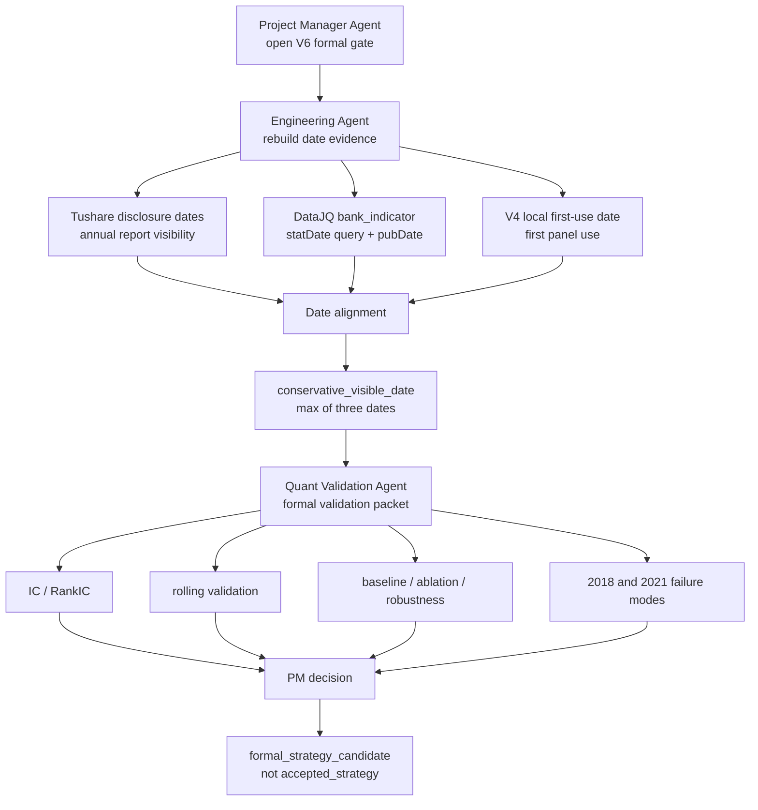

# Bank High Dividend Sustainability V3 - Formal Candidate Test V6

Date: 2026-07-16

Experiment layer:

`research_pit_validation`

## 1. Purpose

The sixth test reruns Bank High Dividend Sustainability V3 after resolving the bank-quality date-lineage issue.

The test answers one PM question:

Can V3 move from `conditional_research_candidate` to `formal_strategy_candidate`?

## 2. Flow



## 3. Data-Lineage Result

Commands:

```text
python -m v5.cli collect-tushare-disclosure-dates
python -m v5.cli collect-joinquant-bank-indicator-pubdates
python -m v5.cli align-bank-quality-dates --external-notice-csv 数据库\processed\tushare_disclosure_dates\tushare_bank_annual_disclosure_dates.csv --joinquant-availability-csv 数据库\processed\joinquant_availability\joinquant_bank_indicator_pubdate.csv
```

DataJQ finding:

- `bank_indicator` still exists in the current `jqdatasdk` package.
- `get_fundamentals(..., date=trade_date)` returns empty frames for `bank_indicator`.
- `get_fundamentals(..., statDate=year)` returns bank-indicator rows and `pubDate`.
- Therefore the previous issue was query mode, not missing JoinQuant data.

Date-alignment result:

| Item | Count |
| --- | ---: |
| aligned rows | 390 |
| formal PIT usable rows | 310 |
| blocked rows | 80 |
| long-history DataJQ `pubDate` rows | 310 / 310 |
| Tushare annual disclosure rows | 310 / 310 |

Status counts:

| Status | Count |
| --- | ---: |
| `aligned_formal_pit_ready` | 310 |
| `blocked_missing_joinquant_available_date_and_local_first_use_date` | 80 |

The 80 blocked rows are the recent Eastmoney-only 2024-2025 extraction rows. They are not required for the V4 long-history formal validation path.

Example:

| Code | Year | Tushare Disclosure | JoinQuant `pubDate` | Local First Use | Conservative Date |
| --- | ---: | --- | --- | --- | --- |
| `000001.XSHE` | 2019 | `2020-02-14` | `2020-02-14` | `2020-11-02` | `2020-11-02` |

## 4. Formal Validation Rerun

Command:

```text
python -m v5.cli validate-formal examples\bank_high_dividend_sustainability_v3_strategy.json 数据库\processed\joinquant_basic_pit_panel_v4_legacy_quality\panel.csv --out validation_formal_v6 --experiment-layer research_pit_validation
```

Generated packet:

```text
validation_formal_v6/bank_high_dividend_sustainability_v3/
```

Notice-date leakage audit:

| Check | Status | Checked Rows | Missing Notice Dates | Future Violations |
| --- | --- | ---: | ---: | ---: |
| `bank_quality_notice_date_visibility` | pass | 1547 | 0 | 0 |

## 5. IC / RankIC

| Factor | Mean IC | Mean RankIC | Positive IC Ratio | Top-Bottom Mean Return |
| --- | ---: | ---: | ---: | ---: |
| `dividend_yield` | 0.1731 | 0.1735 | 77.55% | 2.55% |
| `low_price_to_book` | 0.1109 | 0.1168 | 61.22% | 1.82% |
| `provision_coverage_ratio` | 0.0924 | 0.0459 | 63.83% | 0.41% |
| `return_on_equity_ttm` | 0.0567 | 0.0412 | 57.14% | 1.01% |
| `core_tier_1_capital_adequacy_ratio` | -0.0003 | 0.0225 | 44.68% | 0.19% |

Interpretation:

- Dividend yield is the primary alpha signal.
- Low PB is the strongest support / baseline signal.
- Provision coverage is directionally positive but weaker.
- ROE is mild support.
- Core tier 1 capital is not standalone alpha evidence and should be treated as a quality / risk-control variable.

## 6. Baseline, Ablation, Robustness

Baseline:

| Case | Periods | Cumulative Return | Positive Ratio |
| --- | ---: | ---: | ---: |
| `equal_weight_all_banks` | 57 | 35.1750 | 61.40% |
| `low_pb_top8` | 57 | 4.5241 | 52.63% |
| `composite_current` | 57 | 72.0204 | 66.67% |

Ablation:

| Case | Cumulative Return | Interpretation |
| --- | ---: | --- |
| `composite_current` | 72.0204 | current composite |
| `drop_dividend_yield` | 5.1771 | dividend yield is essential |
| `drop_low_price_to_book` | 65.8142 | low PB supports but is not the sole driver |
| `drop_provision_coverage_ratio` | 65.4535 | provision contributes modestly |
| `drop_core_tier_1_capital_adequacy_ratio` | 70.8872 | capital ratio contribution is weak |

Robustness:

| Case | Cumulative Return | Positive Ratio |
| --- | ---: | ---: |
| `selection_count_6` | 80.5935 | 64.91% |
| `selection_count_8` | 72.0204 | 66.67% |
| `selection_count_10` | 59.2886 | 64.91% |
| `value_weight_scale_0.8` | 66.1371 | 66.67% |
| `value_weight_scale_1.0` | 72.0204 | 66.67% |
| `value_weight_scale_1.2` | 71.6935 | 64.91% |

## 7. Common-Sample Quality Test

Common sample:

| Item | Result |
| --- | ---: |
| rows | 1365 |
| dates | 47 |
| securities | 41 |

| Case | Cumulative Return | Positive Ratio |
| --- | ---: | ---: |
| `common_high_dividend_only` | 3.3723 | 59.57% |
| `common_high_dividend_plus_low_pb` | 3.2373 | 63.83% |
| `common_high_dividend_plus_provision` | 3.1921 | 61.70% |
| `common_high_dividend_plus_capital` | 3.0947 | 57.45% |
| `common_high_dividend_all_support` | 3.6101 | 61.70% |

Interpretation:

The full support layer improves the common-sample cumulative result versus high-dividend-only. However, individual quality factors are not equally strong. Quality should remain a support / risk-control layer, not the core alpha story.

## 8. Weak-Year Review

| Year | Selected Cumulative Return | Positive Ratio | Relative to All-Bank Mean | Relative to Low-PB Mean | Interpretation |
| --- | ---: | ---: | ---: | ---: | --- |
| 2018 | -3.22% | 40.00% | +1.80 pct points | +1.56 pct points | weak absolute year, but relative selection still helped |
| 2021 | 0.97% | 25.00% | +1.57 pct points | +1.41 pct points | weak path stability, but relative selection still helped |

## 9. PM Decision

Decision:

```text
status = formal_strategy_candidate
not_status = accepted_strategy
```

Reason:

- The main source-date blocker is resolved for the V4 long-history bank-quality bridge.
- Tushare disclosure dates and JoinQuant `bank_indicator.pubDate` agree for the long-history annual rows.
- The formal PIT leakage audit passes with zero missing notice dates and zero future violations.
- Dividend yield and low PB have stable statistical evidence.
- The composite beats equal-bank and low-PB baselines in the formal packet.
- Ablation and common-sample tests show the support layer adds value, but only modestly at the individual quality-factor level.

PM constraint:

V3 may enter formal candidate comparison and engineering review, but it is not an accepted strategy. Final acceptance still requires:

1. local daily simulation using the formal candidate version;
2. platform replication against JoinQuant near-5-year output;
3. paper-trading / forward log;
4. no tuning on the 2021-2026 platform-confirmation window.

## 10. Near-Sector Testing Decision

Do not start near-sector testing yet.

Next step should be:

1. freeze V3 as a formal strategy candidate;
2. run engineering replication on the formal candidate;
3. only after that test a nearby sector to evaluate V5 process portability.

