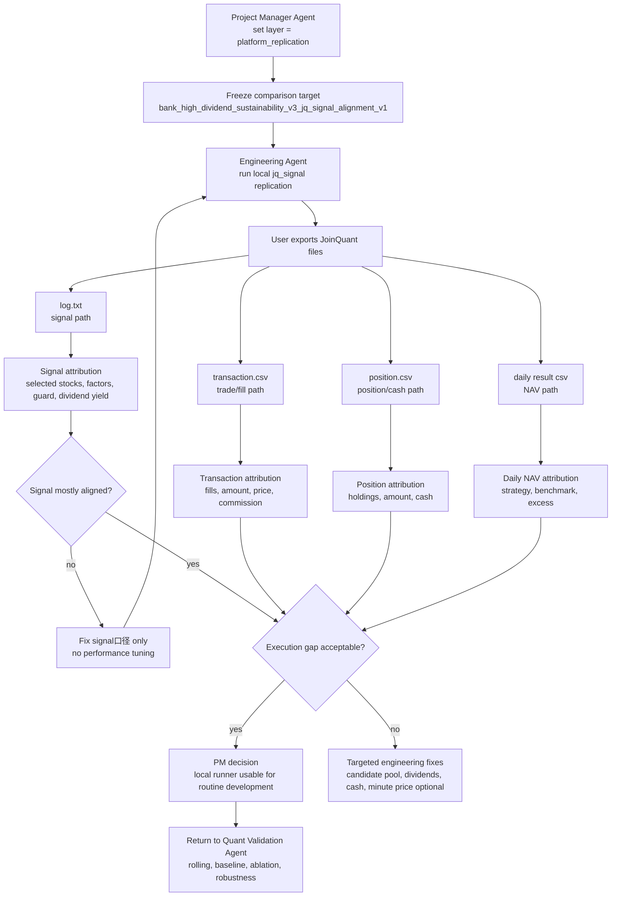

# Bank High Dividend Sustainability V3 - Platform Alignment Test V4

Date: 2026-07-15

## 1. Test Purpose

The fourth test is a `platform_replication` test.

It does not decide whether the bank high-dividend strategy is a valid investment strategy. Its purpose is to close the engineering gap between:

- local V5 JoinQuant-like runner;
- actual JoinQuant simulation exports;
- V3 JoinQuant strategy code and logs.

The key question:

> Can V5 use local runners to reproduce the JoinQuant platform closely enough for normal development, while still reserving final performance confirmation for JoinQuant?

## 2. Fourth-Test Flowchart



## 3. Inputs Used

| Input | Role |
| --- | --- |
| `position.csv` | JoinQuant daily position and cash export |
| `transaction.csv` | JoinQuant order/fill export |
| `log.txt` | JoinQuant signal and score log |
| `result_1 (15).csv` | JoinQuant daily cumulative return export |
| local `daily_returns.csv` | V5 local daily NAV path |
| local `rebalance_signals.csv` | V5 selected-stock path |
| local `trades.csv` | V5 trade path |
| local `holdings.csv` | V5 holding path |

## 4. Local Runner Configuration

Fourth-test local runner:

```text
strategy_id = bank_high_dividend_sustainability_v3
experiment_layer = platform_replication
eastmoney_visibility_mode = joinquant_source_year
value_trap_guard_mode = disabled
signal_dividend_yield_mode = cash_dividend_trailing
execution_price = daily open
valuation_price = daily close
benchmark = 512800.XSHG
window = 2021-05-01 to 2026-05-31
```

Why this configuration:

- JoinQuant logs showed the V3 guard degraded and no value-trap guard was applied.
- JoinQuant V3 code computed dividend yield from trailing visible cash dividends over factor-date close.
- Local runner still uses daily open as an accepted approximation for 09:40 market execution.

## 5. What Was Fixed Before Final V4 Alignment

| Problem | Evidence | Fix |
| --- | --- | --- |
| Local applied value-trap guard, JoinQuant did not | `log.txt` showed `value trap guard degraded` | added `--value-trap-guard-mode disabled` |
| Local dividend yield differed from JoinQuant V3 code | local first-day dividend yields were much higher than JoinQuant log preview | added `--signal-dividend-yield-mode cash_dividend_trailing` |
| Local weighted composite differed from exported JoinQuant code | JoinQuant uses winsorize then z-score and requires factor count | local scoring now supports winsorized z-score and `min_factor_count` |
| Signal comparison was not reusable | temporary analysis only | added position and transaction attribution runners |

## 6. Alignment Results

### 6.1 Signal Alignment

| Metric | Before | After |
| --- | ---: | ---: |
| First-day selected-stock match | 4 / 8 | 8 / 8 |
| Local matched rebalance dates | 19 | 19 |
| Signal set-match dates | not aligned | 17 / 19 |
| Remaining selection mismatch dates | many | 3 |

Remaining signal gaps:

- candidate counts still differ on every rebalance date;
- three rebalance dates still have small selection-set mismatch;
- this likely comes from JoinQuant tradability / valid-data filtering not being fully replicated locally.

### 6.2 Transaction Alignment

| Metric | Before | After |
| --- | ---: | ---: |
| matched transaction keys | 98 | 215 |
| JoinQuant-only transaction keys | 134 | 17 |
| local-only transaction keys | 107 | 5 |
| first-day trade-stock match | 4 / 8 | 8 / 8 |

Remaining transaction gaps:

- JoinQuant executes at 09:40 market price;
- local runner still uses daily open;
- amount and commission differ slightly even when selected stock matches.

### 6.3 Position Alignment

First-day position stocks now fully match.

Remaining position gaps:

- daily position amount still differs because of execution price and accumulated cash path;
- local holdings are stored on rebalance days, while JoinQuant position export has daily rows;
- cash path still needs further reconciliation if exact platform replication is required.

### 6.4 Daily NAV Attribution

| Metric | Value |
| --- | ---: |
| matched days | 1228 |
| final local strategy return | 71.07% |
| final JoinQuant strategy return | 65.19% |
| final strategy difference | +5.88 pct points local |
| final local benchmark return | 25.16% |
| final JoinQuant benchmark return | 26.51% |
| final benchmark difference | -1.35 pct points local |
| max absolute strategy difference | 9.74 pct points |

Interpretation:

- benchmark is close but not exact;
- strategy difference is now mostly an engineering-path difference, not a first-order signal mismatch;
- no single early date fully explains the difference;
- differences accumulate through execution price, residual cash, small remaining signal gaps, and dividend / cash timing.

One notable point:

- on 2026-05-29, cumulative strategy difference narrowed by about 2.85 pct points in one day;
- this should be reviewed later if exact platform replication becomes necessary.

## 7. PM Decision

Decision:

```text
bank_high_dividend_sustainability_v3_jq_signal_alignment_v1
status = usable_for_routine_local_development
not_status = formal_strategy_acceptance
```

Allowed uses:

- local smoke tests;
- comparing new code changes;
- checking whether signals and trades are broadly consistent;
- reducing repeated JoinQuant credit/time usage;
- preparing candidate strategy code before platform confirmation.

Not allowed uses:

- final performance claim;
- formal strategy acceptance;
- replacing rolling validation;
- tuning parameters on 2021-2026 platform results.

## 8. Remaining Engineering Improvements

Priority order:

1. replicate remaining candidate-pool filters for the three signal-mismatch rebalance dates;
2. compare local and JoinQuant cash / dividend path if user exports account cash detail;
3. optionally add 09:40 minute execution prices, but only as platform replication, not alpha optimization;
4. normalize benchmark return calculation to reduce the remaining 1.35 pct-point benchmark gap;
5. add a standard command that runs signal, transaction, position, and NAV attribution as one package.

## 9. Next Recommended Step

After V4 platform alignment, the project should return to `research_pit_validation`.

Next Quant Validation Agent work:

- rolling validation;
- baseline tests;
- ablation tests;
- robustness tests;
- V4 legacy bank-quality source-date audit;
- decision on whether V3 is research-valid or merely platform-replicated.

The fourth test closes the main engineering loop. The fifth test should judge the research hypothesis.

