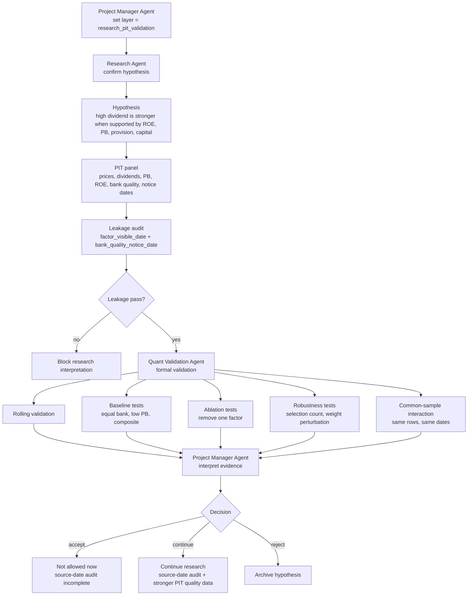

# Bank High Dividend Sustainability V3 - Research Validation Test V5

Date: 2026-07-15

## 1. Test Purpose

The fifth test returns V3 from `platform_replication` to `research_pit_validation`.

The goal is not to reproduce JoinQuant more closely and not to optimize near-5-year return. The goal is to answer:

> Does the bank high-dividend sustainability hypothesis have enough point-in-time statistical evidence to become a formal research candidate?

This test uses the current V4 legacy quality bridge panel:

```text
数据库/processed/joinquant_basic_pit_panel_v4_legacy_quality/panel.csv
```

Important limitation:

The quality data is still a V4 legacy bridge. It is useful for long-sample research, but its source-date assumption still needs independent audit before final acceptance.

## 2. Fifth-Test Flowchart



## 3. Executed Commands

Formal validation was rerun after the fourth-test platform alignment work:

```powershell
$env:PYTHONPATH='src'
python -m v5.cli validate-formal `
  examples\bank_high_dividend_sustainability_v3_strategy.json `
  数据库\processed\joinquant_basic_pit_panel_v4_legacy_quality\panel.csv `
  --out validation_formal `
  --experiment-layer research_pit_validation
```

Output directory:

```text
validation_formal/bank_high_dividend_sustainability_v3/
```

## 4. Leakage Audit

| Check | Result |
| --- | --- |
| checked rows | 1547 |
| missing notice-date rows | 0 |
| future notice violations | 0 |
| status | pass |

Interpretation:

The current panel has the required visibility fields and passes the mechanical notice-date audit.

Governance warning:

Passing the mechanical audit does not fully prove that V4 legacy quality source dates are economically correct. The original announcement-date source still needs review.

## 5. Rolling Validation

| Year | Cum Return | Positive Ratio | Interpretation |
| --- | ---: | ---: | --- |
| 2016 | 14.57% | 80.00% | positive |
| 2017 | 398.42% | 80.00% | very strong, likely regime / data sensitivity |
| 2018 | -3.22% | 40.00% | weak year |
| 2019 | 137.03% | 71.43% | strong |
| 2020 | 26.52% | 60.00% | positive |
| 2021 | 0.97% | 25.00% | weak |
| 2022 | 30.14% | 60.00% | positive |
| 2023 | 3.85% | 75.00% | mild positive |
| 2024 | 47.23% | 100.00% | strong |
| 2025 | 15.02% | 75.00% | positive |
| 2026 | 1.39% | 100.00% | incomplete year |

Interpretation:

- Evidence is directionally positive across most years.
- 2018 and 2021 are weak points.
- 2017 is unusually strong and should not be over-interpreted.
- Rolling behavior supports continued research but does not justify final acceptance alone.

## 6. Baseline Tests

| Case | Periods | Cum Return | Mean Return | Positive Ratio |
| --- | ---: | ---: | ---: | ---: |
| equal_weight_all_banks | 57 | 3517.50% | 11.47% | 61.40% |
| low_pb_top8 | 57 | 452.41% | 3.62% | 52.63% |
| composite_current | 57 | 7202.04% | 12.70% | 66.67% |

Interpretation:

- The current composite beats the low-PB baseline.
- Equal-weight all-bank return is also very high, meaning the sample/regime itself is favorable and must be treated carefully.
- Because the absolute cumulative returns are extreme, PM should focus on relative factor evidence and robustness rather than headline return.

## 7. Ablation Tests

| Case | Cum Return | Positive Ratio | Interpretation |
| --- | ---: | ---: | --- |
| composite_current | 7202.04% | 66.67% | current full composite |
| drop_dividend_yield | 517.71% | 59.65% | major deterioration |
| drop_return_on_equity_ttm | 6630.78% | 64.91% | small deterioration |
| drop_low_price_to_book | 6581.42% | 68.42% | small deterioration |
| drop_provision_coverage_ratio | 6545.35% | 63.16% | small deterioration |
| drop_core_tier_1_capital_adequacy_ratio | 7088.72% | 68.42% | almost unchanged |

Interpretation:

- Dividend yield is the core alpha driver.
- ROE, PB, and provision appear to be support / ranking stabilizers rather than dominant alpha drivers.
- Core tier 1 capital adequacy is weak as a standalone contributor and should be treated more as a risk-control or sanity-check variable.

## 8. Robustness Tests

| Case | Cum Return | Positive Ratio |
| --- | ---: | ---: |
| selection_count_6 | 8059.35% | 64.91% |
| selection_count_8 | 7202.04% | 66.67% |
| selection_count_10 | 5928.86% | 64.91% |
| value_weight_scale_0.8 | 6613.71% | 66.67% |
| value_weight_scale_1.0 | 7202.04% | 66.67% |
| value_weight_scale_1.2 | 7169.35% | 64.91% |

Interpretation:

- Results are not destroyed by selection count changes from 6 to 10.
- Value-weight perturbation is reasonably stable.
- Selection count 6 is strongest, but this must not be used for tuning on the current sample.

## 9. Common-Sample Interaction

Common sample:

| Item | Count |
| --- | ---: |
| rows | 1365 |
| dates | 47 |
| securities | 41 |

| Case | Cum Return | Mean Return | Positive Ratio |
| --- | ---: | ---: | ---: |
| high dividend only | 337.23% | 3.71% | 59.57% |
| high dividend + ROE | 313.76% | 3.62% | 65.96% |
| high dividend + low PB | 323.73% | 3.63% | 63.83% |
| high dividend + provision | 319.21% | 3.64% | 61.70% |
| high dividend + capital | 309.47% | 3.57% | 57.45% |
| high dividend + provision + capital | 313.44% | 3.61% | 59.57% |
| high dividend + all support fields | 361.01% | 3.84% | 61.70% |

Interpretation:

- Raw high dividend is already a strong factor.
- Single support fields do not individually improve cumulative return.
- The all-support composite modestly beats high dividend alone on common sample.
- The “sustainability” story is plausible, but the incremental evidence is modest.

## 10. Research Judgment

V3 research evidence:

| Question | Answer |
| --- | --- |
| Is dividend yield useful? | Yes, strongest evidence. |
| Does low PB help? | Some support, weaker than dividend yield. |
| Does ROE help? | Mild support, not decisive. |
| Does provision coverage help? | Directionally useful, modest contribution. |
| Does core tier 1 capital help as alpha? | Weak. Better treated as risk / quality control. |
| Does full sustainability composite beat high dividend alone? | Yes, but only modestly on common sample. |
| Is V3 acceptable as final strategy? | No. Source-date audit remains incomplete. |

## 11. Project Manager Decision

Decision:

```text
status = continue_research_not_formal_acceptance
```

Reason:

The high-dividend bank hypothesis has enough evidence to continue. Dividend yield is clearly important, robustness is acceptable, and the all-support composite modestly improves common-sample results.

However, V3 cannot be formally accepted yet because:

- V4 legacy quality data still requires source-date review;
- current cumulative returns are extreme and may reflect sample/regime effects;
- quality factors add modest rather than decisive incremental evidence;
- platform replication is useful but cannot substitute for research validation;
- 2021-2026 platform results must not be used for parameter tuning.

## 12. Required Next Work

Next Research Agent work:

1. audit V4 legacy bank-quality source dates;
2. identify whether each quality field was actually visible before the rebalance date;
3. replace source-year assumptions with report announcement dates where possible;
4. document field-level source confidence.

Next Quant Validation Agent work:

1. rerun formal validation after source-date audit;
2. add factor IC / RankIC report into the formal packet;
3. separate dividend alpha from quality/risk-control contribution;
4. run failure-mode review for weak years 2018 and 2021.

Next Project Manager gate:

```text
Do not promote V3 until source-date audit is complete.
```

