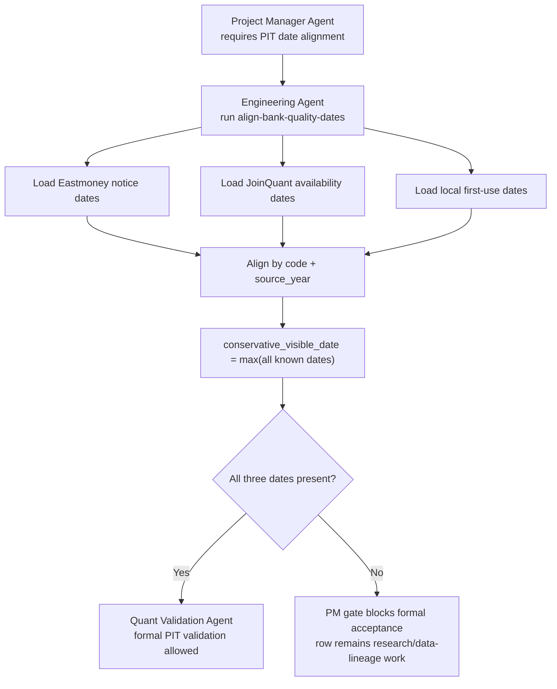

# Bank Quality Date Alignment

Date: 2026-07-16

## Purpose

Bank-specialized quality factors must not enter formal research validation unless their visibility date is conservative and auditable.

For each bank-quality snapshot, V5 now aligns three dates:

| Date Type | Meaning | Current Source |
| --- | --- | --- |
| `eastmoney_notice_date` | original report / announcement evidence from Eastmoney or exchange filings | `<database_dir>/processed/eastmoney_bank_quality_manual_csv.csv` |
| `joinquant_available_date` | the date when JoinQuant could actually expose the same bank-quality item | optional JoinQuant availability CSV |
| `local_first_use_date` | the first date the local V4/V5 panel used the item | `<database_dir>/processed/v4_legacy_bank_quality.csv` |

The formal PIT rule is:

```text
conservative_visible_date = max(eastmoney_notice_date, joinquant_available_date, local_first_use_date)
```

Rows are formal PIT usable only when all three dates are known.

## Flow



## Command

```text
python -m v5.cli align-bank-quality-dates
```

Optional JoinQuant availability evidence can be provided with:

```text
python -m v5.cli align-bank-quality-dates --joinquant-availability-csv path/to/joinquant_bank_quality_availability.csv
```

Expected JoinQuant availability columns:

```text
code,source_year,joinquant_available_date,review_status,confidence,source_note
```

Aliases accepted by the runner:

- `report_year` for `source_year`;
- `jq_available_date`, `available_date`, or `notice_date` for `joinquant_available_date`.

## Current Result

Generated outputs:

```text
<database_dir>/processed/bank_quality_date_alignment/bank_quality_date_alignment.csv
<database_dir>/processed/bank_quality_date_alignment/bank_quality_date_alignment_manifest.json
<database_dir>/processed/bank_quality_date_alignment/bank_quality_date_alignment_report.md
```

Current summary:

| Item | Count |
| --- | ---: |
| aligned rows | 390 |
| formal PIT usable rows | 0 |
| blocked rows | 390 |

Blocked status:

| Status | Count | Meaning |
| --- | ---: | --- |
| `blocked_missing_eastmoney_notice_date_and_joinquant_available_date` | 310 | long-history V4 rows have local first-use dates, but no original Eastmoney / exchange announcement evidence and no JoinQuant availability evidence |
| `blocked_missing_joinquant_available_date_and_local_first_use_date` | 80 | recent Eastmoney rows have original notice dates, but no JoinQuant availability date and no local first-use bridge date |

## PM Decision

This closes the ambiguity:

- the missing evidence is local evidence-chain completeness, not proof that JoinQuant or Eastmoney is wrong;
- JoinQuant and Eastmoney may have different collection dates;
- formal research should use the most conservative date only after all three date types are present;
- until then, V3 can remain `conditional_research_candidate`, but cannot become `formal_strategy_candidate` because bank-quality PIT lineage is not closed.

## Next Work

1. Engineering Agent builds or imports a JoinQuant bank-quality availability table.
2. Research Agent decides which quality fields are essential enough to justify historical Eastmoney / exchange source-date collection.
3. Quant Validation Agent reruns formal validation using `conservative_visible_date`.
4. Project Manager Agent only reopens candidate acceptance after `formal_pit_usable=true` covers the rows used by the strategy.
