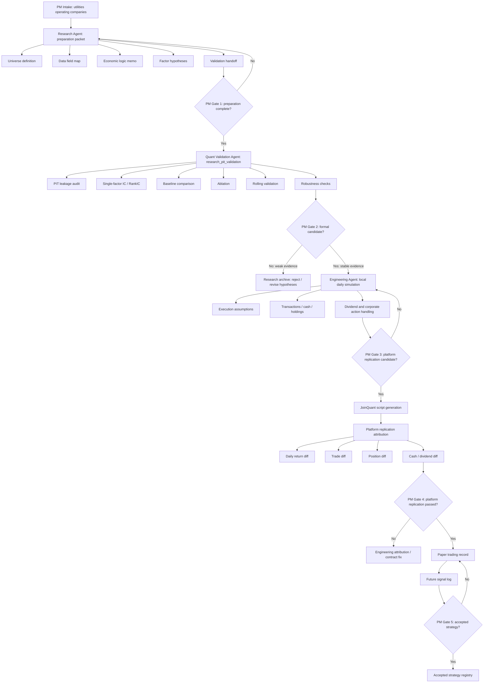

# V5.1 Utilities Full Workflow

Date: 2026-07-16

Owner:

Project Manager Agent

Project:

```text
V5.1 Utilities Sector Process-Portability Test
```

Current status:

```text
research_preparation_packet_in_progress
```

## Purpose

V5.1 tests whether the V5 research framework can be reused outside the bank sector. The first test sector is A-share utilities operating companies, with priority on electric power operators.

The purpose is process portability, not immediate strategy acceptance.

## Experiment Separation

Every V5.1 result must be tagged as exactly one of:

```text
research_pit_validation
platform_replication
engineering_smoke_test
paper_trading
```

Project Manager Agent must block any report that mixes research validation, platform replication, and paper trading.

## Full Workflow



## Agent Responsibilities

| Stage | Owner | Output | Not allowed |
| --- | --- | --- | --- |
| Intake | Project Manager Agent | scope, gates, status | factor tuning |
| Research preparation | Research Agent | universe, field map, hypotheses | backtest code |
| PIT validation | Quant Validation Agent | IC, RankIC, baseline, ablation, rolling, robustness | inventing theory after seeing returns |
| Local simulation | Engineering Agent | local daily runner, execution logs | changing research conclusion |
| Platform replication | Engineering Agent + PM | local vs JoinQuant attribution | treating platform return as research validation |
| Paper trading | PM + Engineering Agent | future signal record | retroactive parameter changes |

## Gate 1: Preparation Complete

Required files:

- `utilities_universe_definition.md`
- `utilities_data_field_map.md`
- `utilities_value_investing_framework.md`
- `utilities_core_factor_hypotheses.md`
- `utilities_validation_handoff.md`

PM may approve `research_pit_validation` only when all five files exist and explicitly exclude broad high-dividend SOE baskets.

## Gate 2: Formal Candidate

Quant Validation Agent must provide:

- PIT leakage audit;
- IC / RankIC;
- equal-utility baseline;
- low-PB baseline;
- high-dividend baseline;
- ablation by factor module;
- rolling validation;
- robustness checks;
- weak-year analysis if weak periods appear.

Research evidence must remain independent from 2021-2026 platform replication results.

## Gate 3: Platform Replication Candidate

Engineering Agent may start platform replication only after PM freezes a formal research candidate.

Required engineering artifacts:

- frozen strategy specification;
- local daily simulation;
- transaction, position, cash, dividend logs;
- execution-price assumptions;
- benchmark definition;
- JoinQuant script generated from the frozen spec.

## Gate 4: Platform Replication Passed

PM must judge local vs JoinQuant alignment with:

- daily strategy return attribution;
- benchmark return attribution;
- transaction comparison;
- holding comparison on rebalance dates;
- cash and dividend comparison;
- explanation of residual differences.

## Gate 5: Accepted Strategy

A strategy cannot be accepted only because platform replication passes. It must also survive forward / paper trading and retain financial and statistical explanation.

## Initial Decision

V5.1 is approved for preparation and Research Agent packet generation.

V5.1 is not approved for engineering backtest or platform replication yet.
