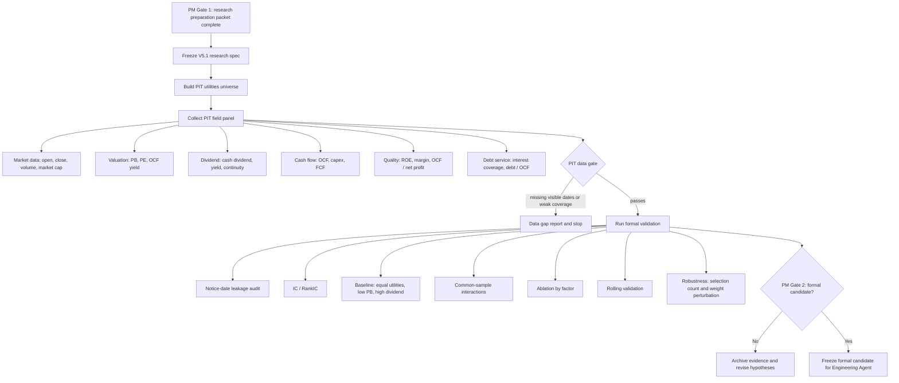

# V5.1 Utilities Quant Validation Flow

Date: 2026-07-16

Owner:

Quant Validation Agent

Project:

```text
V5.1 Utilities Sector Process-Portability Test
```

Experiment layer:

```text
research_pit_validation
```

## Purpose

This flow starts the first formal non-bank validation path for V5.1. It tests whether the V5 validation process can be reused for A-share utilities operating companies without bank-specific indicators.

It does not approve a strategy and does not start platform replication.

## Flow



## Frozen Research Spec

The V5.1 research validation spec is:

```text
examples/utilities_value_quality_v51_strategy.json
```

Current status:

```text
research_pit_validation_ready
```

Not status:

```text
formal_strategy_candidate
platform_replication_candidate
accepted_strategy
```

## Required Panel Contract

The formal validation panel must contain at minimum:

- `trade_date`
- `code`
- `future_return` or `total_return`
- `factor_visible_date` or `notice_date` or `announce_date`
- `low_price_to_book`
- `dividend_yield`
- `operating_cash_flow_yield`
- `return_on_equity_ttm`
- `operating_cash_flow_to_net_profit`
- `interest_coverage`
- `capex_burden`

Recommended metadata:

- `sub_industry`
- `listing_date`
- `is_st`
- `is_suspended`
- `limit_status`
- `dividend_announcement_date`
- `ex_dividend_date`
- `cash_dividend_payment_date`

## Execution Commands

Spec audit:

```powershell
$env:PYTHONPATH='src'
python -m v5.cli validate examples\utilities_value_quality_v51_strategy.json
```

Formal validation after PIT panel exists:

```powershell
$env:PYTHONPATH='src'
python -m v5.cli validate-formal examples\utilities_value_quality_v51_strategy.json 数据库\processed\utilities_pit_panel\panel.csv --out validation_formal_v51 --experiment-layer research_pit_validation
```

## PM Blocking Rules

PM must stop the flow if:

- the universe is a high-dividend SOE style basket instead of utilities operating companies;
- financial fields have no visible date;
- dividend announcement, ex-dividend, and payment dates are mixed;
- the validation panel uses future industry classification;
- full-sample normalization appears;
- 2021-2026 platform results are used for tuning;
- Engineering Agent starts JoinQuant code before a formal research candidate is frozen.

## Success Criteria

V5.1 can move toward `formal_strategy_candidate` only if:

- leakage audit passes;
- at least one utilities-specific factor has positive IC / RankIC evidence;
- composite results beat equal-utilities, low-PB, and high-dividend baselines on a PIT basis;
- ablation shows the result is not only one accidental exposure;
- rolling validation is not dominated by a single short window;
- robustness survives small changes in selection count and weights;
- retained factors remain financially explainable for utilities.

## Current Execution Result

Completed in this step:

- V5.1 research spec created;
- formal validation runner generalized for non-bank strategies;
- high-dividend baseline ordering fixed;
- utilities-specific common-sample interactions enabled;
- local test suite passed.

Pending:

- real utilities PIT panel collection;
- formal `validate-formal` run on the real panel;
- PM Gate 2 decision.
