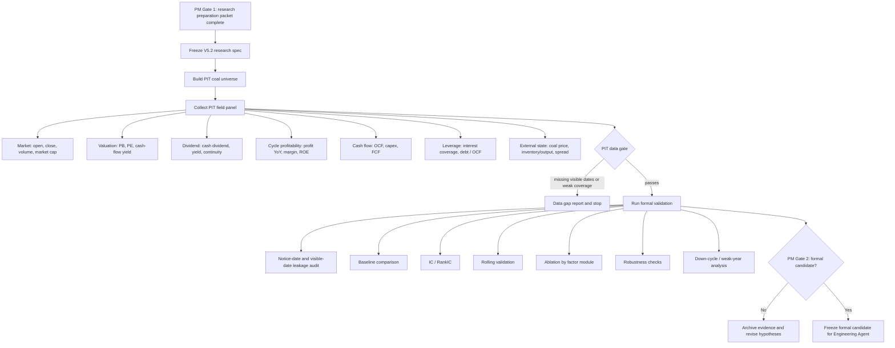

# V5.2 Coal Quant Validation Flow

Date: 2026-07-16

Owner:

Quant Validation Agent

Project:

```text
V5.2 Coal High-Dividend / Cycle-Value Process-Portability Test
```

Experiment layer:

```text
research_pit_validation
```

## Purpose

This flow defines the formal validation path for a coal-sector research candidate.

It does not approve a strategy and does not start platform replication.

## Flow



## Frozen Research Spec

The V5.2 pre-research spec is:

```text
examples/coal_high_dividend_cycle_value_v52_strategy.json
```

Current status:

```text
pre_research_candidate
```

Not status:

```text
formal_strategy_candidate
platform_replication_candidate
accepted_strategy
```

## Required Panel Contract

The formal validation panel must contain at minimum:

- `trade_date`;
- `code`;
- `future_return` or `total_return`;
- `factor_visible_date` or `notice_date` or `announce_date`;
- `coal_business_tag`;
- `low_price_to_book`;
- `price_to_earnings`;
- `dividend_yield`;
- `operating_cash_flow_yield`;
- `free_cash_flow_yield` where available;
- `profit_growth_yoy`;
- `operating_cash_flow_to_net_profit`;
- `capex_burden`;
- `asset_liability_ratio`;
- `interest_coverage`;
- `thermal_coal_price_state`;
- `coking_coal_price_state`;
- `coal_inventory_or_output_state`;
- `coal_power_spread_state`.

Recommended metadata:

- `sub_industry`;
- `listing_date`;
- `is_st`;
- `is_suspended`;
- `limit_status`;
- `dividend_announcement_date`;
- `ex_dividend_date`;
- `cash_dividend_payment_date`;
- `external_state_source_publication_date`;
- `external_state_visible_date`.

## Execution Commands

Spec audit:

```powershell
$env:PYTHONPATH='src'
python -m v5.cli validate examples\coal_high_dividend_cycle_value_v52_strategy.json
```

Formal validation after PIT panel exists:

```powershell
$env:PYTHONPATH='src'
python -m v5.cli validate-formal examples\coal_high_dividend_cycle_value_v52_strategy.json 数据库\processed\coal_pit_panel\panel.csv --out validation_formal_v52 --experiment-layer research_pit_validation
```

## Baselines

Quant Validation Agent must compare against:

- equal-weight coal universe;
- high dividend yield top N;
- low PB top N;
- high operating-cash-flow-yield top N;
- high free-cash-flow-yield top N if coverage passes;
- coal price state conditioned baseline;
- core-coal-only baseline excluding mixed coal-chemical companies.

## Robustness Checks

Required robustness checks:

- selection count 5 / 8 / 10 / 12;
- factor weight perturbation where composite scoring is used;
- state threshold perturbation;
- rebalance month perturbation;
- excluding mixed-company tags;
- thermal coal and coking coal subgroup split;
- random backtest-window stress;
- random small execution-date shift for local simulation after formal candidate approval.

## PM Blocking Rules

PM must stop the flow if:

- the universe becomes a high-dividend SOE style basket;
- external state variables do not have visible dates;
- dividend announcement, ex-dividend, and payment dates are mixed;
- industry membership uses future classification without an availability rule;
- full-sample normalization appears;
- 2021-2026 platform results are used for tuning;
- Engineering Agent starts JoinQuant code before a formal research candidate is frozen.

## Success Criteria

V5.2 can move toward `formal_strategy_candidate` only if:

- leakage audit passes;
- at least one coal-specific factor or state-conditioned rule has positive IC / RankIC evidence;
- candidate results beat relevant baselines on a PIT basis;
- ablation shows the result is not only one accidental exposure;
- rolling validation is not dominated by one coal boom window;
- robustness survives small changes in selection count, state thresholds, and universe exclusions;
- retained factors remain financially explainable for coal cyclicality.

## Current Execution Result

Completed in this step:

- V5.2 PM intake created;
- V5.2 workflow, research task, and quant validation flow documented;
- V5.2 pre-research strategy spec created;
- Research Agent coal knowledge packet initialized.

Pending:

- real coal PIT panel collection;
- external coal-cycle state panel collection and visible-date audit;
- formal `validate-formal` run on the real panel;
- PM Gate 2 decision.
