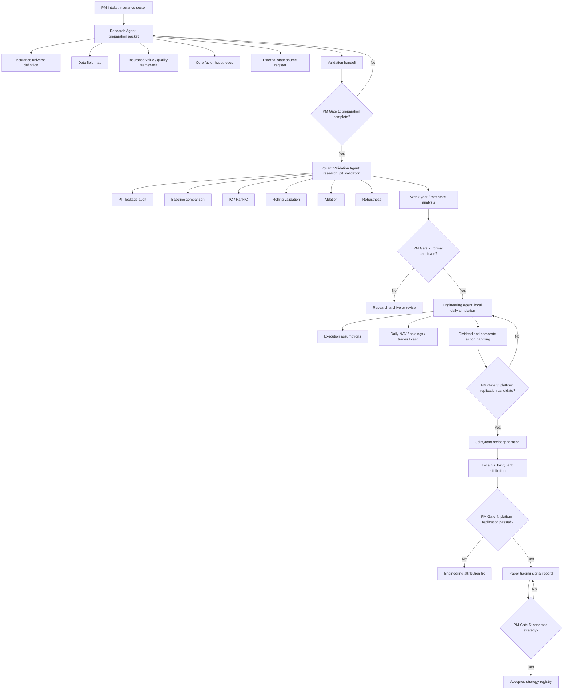

# V5.3 Insurance Full Workflow

Date: 2026-07-16

Owner:

Project Manager Agent

Project:

```text
V5.3 Insurance Value / Quality Process-Portability Test
```

Current status:

```text
research_preparation_started
```

## Purpose

V5.3 tests whether the V5 research framework can transfer from banks to another financial sector without reusing bank-specific assumptions.

The goal is not to immediately produce a profitable insurance strategy. The goal is to test whether Research, Quant Validation, Engineering and PM governance can handle a different financial business model.

## Initial Boundary

Approved universe:

```text
A-share listed insurance companies and insurance-led holding companies
```

Priority universe:

- life insurance;
- property and casualty insurance;
- listed insurance groups where insurance is the dominant economic exposure.

Exclude by default:

- banks;
- brokers and diversified financials without dominant insurance exposure;
- pure asset managers;
- insurance technology vendors;
- cross-industry financial holding companies where insurance is not the main profit driver.

## Experiment Separation

Every result must be tagged as exactly one of:

```text
research_pit_validation
platform_replication
engineering_smoke_test
paper_trading
```

PM must block reports that mix research validation, platform replication and paper trading.

## Workflow



## PM Gate 1

Research Agent must produce:

- insurance universe definition;
- insurance data field map;
- insurance source collection plan;
- insurance value / quality framework;
- insurance core factor hypotheses;
- insurance validation handoff.

PM may approve Quant Validation only when the packet separates:

- life insurance from P&C insurance;
- accounting profit from embedded value / new business quality;
- investment income from underwriting quality;
- interest-rate state from stock-specific factors.

## PM Gate 2

Quant Validation Agent must provide:

- PIT leakage audit;
- baseline comparison;
- IC / RankIC;
- rolling validation;
- ablation by module;
- robustness checks;
- weak-year analysis;
- interest-rate and equity-market state buckets.

No factor may be accepted only because 2021-2026 performance is high.

## PM Gate 3

Engineering Agent may start local daily simulation only after PM freezes a formal research candidate.

Required engineering artifacts:

- frozen strategy specification;
- daily execution-price data;
- benchmark definition;
- dividends and corporate actions;
- holdings, trades, cash and rebalance logs;
- overfit audit inputs.

## Initial PM Decision

V5.3 is approved for research preparation.

V5.3 is not approved for platform replication or JoinQuant code yet.

