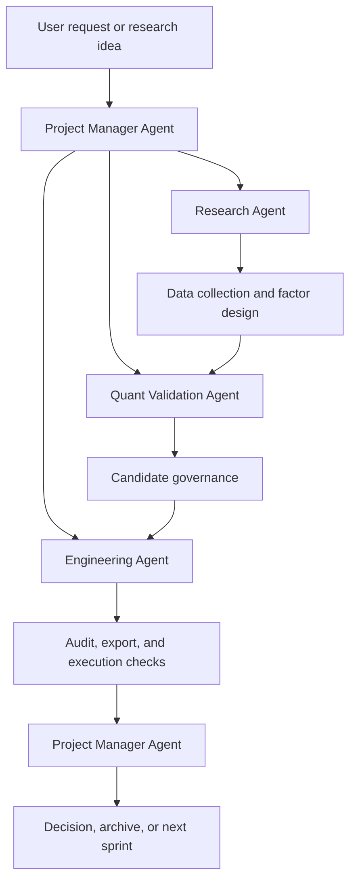

# Bank Quant V5 Skill Map

## Purpose

This map defines when each V5 agent should call each skill during the research lifecycle.

V5 should not treat skills as isolated notes. Skills are operating procedures that move a hypothesis from idea, to data, to validation, to implementation, to archive.

## End-to-End Workflow



## Phase 0: Project Intake and Orchestration

Owner: Project Manager Agent

Core question: what should happen next?

Use these skills:

- `v5-controller`: coordinate the full workflow.
- `skill-lifecycle-manager`: update, limit, disable, or create skills when reality changes.
- `candidate-governance`: define baseline, candidate set, and decision status before comparison.
- `research-archive-freeze`: check whether an old branch is frozen or can be reopened.

Outputs:

- task list;
- development plan;
- decision log;
- sprint report;
- skill lifecycle update when needed.

## Phase 1: Research Hypothesis and Factor Design

Owner: Research Agent

Core question: why is this worth researching?

Use these skills:

- `research-agent`: structure the research role and boundaries.
- `factor-research`: convert an investment idea into factor logic.
- `strategy-spec`: describe the intended strategy contract.
- `momentum-research`: research momentum factors, state dependence, and deployment role.
- `mean-reversion-research`: research short-horizon reversal and tactical timing.
- `defensive-overlay-research`: define risk-control overlays separately from alpha.
- `state-routing-research`: design state machines, warnings, exits, and switches.
- `allocation-selection-separator`: separate allocation hypotheses from selection hypotheses.

Outputs:

- research proposal;
- hypothesis;
- factor specification;
- experiment design;
- strategy skeleton.

## Phase 2: Data Collection and Standardization

Owner: Research Agent with Engineering Agent support

Core question: can the required information be collected reproducibly?

Use these skills:

- `data-source-router`: choose the source path before collection.
- `joinquant-a-share-collector`: collect JoinQuant A-share market, valuation, and security data when available.
- `tushare-data-collector`: collect alternative market and financial data when appropriate.
- `financial-statement-standardizer`: standardize financial statement fields.
- `bank-indicator-replacement-collector`: replace unavailable JoinQuant bank indicators through reconstructed ratios and documented proxies.
- `annual-report-bank-indicator-collector`: collect bank-specific indicators from annual reports when structured APIs are insufficient.
- `skill-lifecycle-manager`: mark a collector limited, deprecated, disabled, or candidate if source conditions change.

Outputs:

- raw source files;
- standardized datasets;
- source labels;
- data availability report;
- collection warnings.

Important constraint:

JoinQuant `bank_indicator` is unavailable for new V5 collection work. Use replacement collectors, reconstructed ratios, annual reports, and explicit source labels.

## Phase 3: Statistical Validation

Owner: Quant Validation Agent

Core question: is there evidence to support this?

Use these skills:

- `quant-validation-agent`: enforce validation role boundaries.
- `statistical-validation-protocol`: run factor evidence, rolling validation, robustness, leave-one-out, common-sample comparison, and freeze packets.
- `rolling-validation`: validate through rolling train/test/review windows.
- `strategy-attribution`: explain whether improvement comes from selection, allocation, cash, overlap, turnover, execution, or risk.
- `allocation-selection-separator`: prevent allocation effects from being misread as stock-selection alpha.

Outputs:

- validation report;
- statistical evidence;
- factor ranking;
- robustness report;
- attribution report;
- recommendation for candidate governance.

## Phase 4: Candidate Governance and Research Decision

Owner: Project Manager Agent

Core question: should this candidate be promoted, kept, archived, rejected, or left pending?

Use these skills:

- `candidate-governance`: rank candidates against the active baseline.
- `strategy-attribution`: explain incremental contribution before ranking.
- `execution-stress-test`: confirm the candidate is not execution-fragile.
- `research-archive-freeze`: freeze decisions, archive branches, and record revisit conditions.
- `research-report`: write the human-readable decision report.

Outputs:

- formal candidate ranking;
- decision log;
- final validation packet;
- archive packet;
- next research direction.

Decision statuses:

- `promote`;
- `keep_as_alternative`;
- `archive`;
- `reject`;
- `pending`.

## Phase 5: Engineering Implementation

Owner: Engineering Agent

Core question: how can this be implemented reliably?

Use these skills:

- `engineering-agent`: enforce engineering role boundaries.
- `strategy-spec`: convert approved research into a structured contract.
- `data-leakage-audit`: check future leakage, look-ahead bias, survivorship bias, and data leakage.
- `execution-consistency`: compare local logic and platform behavior.
- `joinquant-local-replication`: run local JoinQuant-compatible daily simulation, write snapshots, and prepare platform attribution.
- `joinquant-strategy-exporter`: export the frozen strategy to JoinQuant code.
- `execution-stress-test`: test transaction cost, delay, and turnover assumptions.

Outputs:

- strategy code;
- backtest artifacts;
- audit report;
- platform export;
- integration and unit tests;
- execution consistency report.

## Phase 6: Final Freeze and Lifecycle Update

Owner: Project Manager Agent

Core question: what should become permanent project memory?

Use these skills:

- `research-archive-freeze`: freeze accepted, rejected, and archived branches.
- `skill-lifecycle-manager`: update skill status after source, API, workflow, or method changes.
- `candidate-governance`: record the final active baseline and alternatives.
- `research-report`: produce the final sprint or phase report.

Outputs:

- active baseline record;
- archived branch record;
- disabled or candidate skill notes;
- final sprint report;
- next roadmap item.

## Agent-to-Skill Matrix

| Agent | Primary skills | Support skills |
| --- | --- | --- |
| Project Manager Agent | `v5-controller`, `candidate-governance`, `research-archive-freeze`, `skill-lifecycle-manager` | `research-report`, `strategy-attribution`, `execution-stress-test` |
| Research Agent | `research-agent`, `factor-research`, `strategy-spec`, `momentum-research`, `mean-reversion-research`, `defensive-overlay-research`, `state-routing-research` | `allocation-selection-separator`, `data-source-router` |
| Quant Validation Agent | `quant-validation-agent`, `statistical-validation-protocol`, `rolling-validation`, `strategy-attribution` | `allocation-selection-separator`, `candidate-governance`, `execution-stress-test` |
| Engineering Agent | `engineering-agent`, `strategy-spec`, `data-leakage-audit`, `joinquant-local-replication`, `execution-consistency`, `joinquant-strategy-exporter` | `execution-stress-test`, `data-source-router`, `financial-statement-standardizer` |

## Default Skill Chain

Use this chain for a normal new research idea:

```text
v5-controller
  -> research-agent
  -> factor-research
  -> data-source-router
  -> relevant collector skills
  -> financial-statement-standardizer
  -> statistical-validation-protocol
  -> strategy-attribution
  -> candidate-governance
  -> strategy-spec
  -> data-leakage-audit
  -> execution-stress-test
  -> joinquant-local-replication
  -> joinquant-strategy-exporter
  -> execution-consistency
  -> research-archive-freeze
  -> skill-lifecycle-manager when any skill changes status
```

## Global Rule

Every decision must be evidence-driven, financially explainable, statistically validated, reproducible, and maintainable. Historical performance alone is never sufficient evidence for accepting a strategy.
