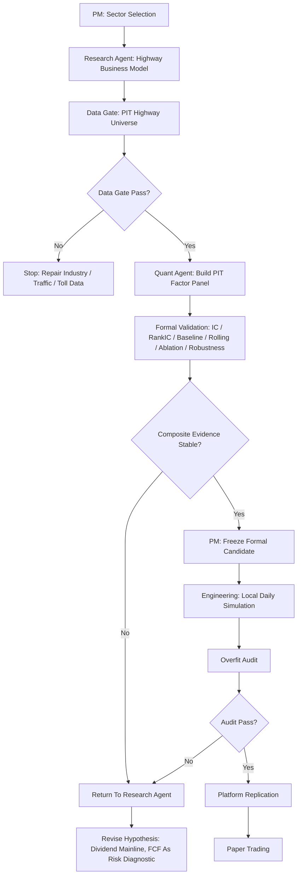

# V5.4 Highway Cash-Flow Dividend Workflow V1

Date: 2026-07-18

Status:

```text
workflow_executed_test1_research_return_required
```

Sector:

```text
交通基础设施 / 高速公路运营类
```

Strategy ID:

```text
highway_cashflow_dividend_v54
```

## Purpose

V5.4 tests whether V5 can move toward a cross-sector dividend, low-volatility and free-cash-flow enhanced basket.

The first boundary is deliberately narrow:

```text
Toll-road / highway operators only.
```

Ports, airports, rail, shipping and logistics are excluded from Test-1.

## Flowchart



## Lessons Imported From V5.1 / V5.2 / V5.3

From V5.1 utilities:

- Start with sector knowledge and external state awareness before platform testing.
- Use local PIT validation before JoinQuant code.
- Keep platform replication separate from research tuning.

From V5.2 coal:

- Do not force a cyclical or structurally declining sector just because dividend yield is high.
- If external state history is missing, stop before strategy promotion.
- For highway, traffic volume, toll policy and concession duration are future data requirements.

From V5.3 insurance:

- Use a sector-specific value anchor when generic factors are too weak.
- Enforce PIT visibility and source repair before formal validation.
- Freeze only after evidence, not after a good-looking backtest.

## V5.4 Test-1 Execution

Data source:

```text
JoinQuant HY03160 高速公路
```

Important data limitation:

```text
HY03160 starts in JoinQuant from 2021-12-13, so Test-1 starts in 2022.
```

Generated panel:

```text
数据库/processed/highway_pit_panel_v54/panel.csv
```

Coverage:

| Item | Value |
| --- | ---: |
| Rows | 344 |
| Rebalance dates | 18 |
| Codes | 20 |
| First date | 2022-01-04 |
| Last date | 2026-04-01 |
| Warnings | 0 |

Field coverage:

| Field | Coverage |
| --- | ---: |
| dividend_yield | 100.0% |
| operating_cash_flow_yield | 100.0% |
| free_cash_flow_yield | 100.0% |
| fcf_dividend_support | 91.6% |
| low_price_to_book | 100.0% |
| pe_ratio | 100.0% |
| interest_coverage | 99.4% |
| capex_burden | 100.0% |
| asset_liability_ratio | 100.0% |

Formal validation:

```text
validation_formal_v54_highway_cashflow_dividend/highway_cashflow_dividend_v54/
```

## Quant Result

PIT leakage audit:

```text
pass
```

Single-factor evidence:

| Factor | Mean IC | Mean RankIC | Positive IC Ratio | Read |
| --- | ---: | ---: | ---: | --- |
| dividend_yield | 0.2225 | 0.2298 | 72.22% | strong |
| free_cash_flow_yield | -0.0143 | -0.0026 | 50.00% | weak |
| fcf_dividend_support | -0.0229 | -0.0350 | 38.89% | weak / negative |
| low_price_to_book | -0.0028 | 0.0290 | 38.89% | weak |
| capex_burden | 0.0210 | -0.0429 | 44.44% | unstable |
| asset_liability_ratio | 0.0216 | 0.0214 | 50.00% | weak |

Baseline performance:

| Case | Cumulative Return | Read |
| --- | ---: | --- |
| equal_weight_highway | 42.56% | sector beta strong |
| high_dividend_highway_top8 | 78.84% | best evidence |
| high_fcf_yield_highway_top8 | 29.00% | weak |
| low_pb_highway_top8 | 51.69% | useful but below dividend |
| composite_current | 54.70% | positive but below high dividend |

Rolling validation:

| Year | Composite Return | Read |
| --- | ---: | --- |
| 2024 | 29.76% | strong |
| 2025 | 1.46% | barely positive |
| 2026 | -10.16% | weak year, not solved |

## PM Decision

V5.4 Test-1 proves that the workflow can run on highway operators.

However, the current cash-flow-dividend composite is not promoted to engineering because:

- high dividend alone is much stronger than the composite;
- FCF yield and FCF dividend support have weak or negative IC;
- cash-flow support variables currently behave more like risk diagnostics than alpha factors;
- the formal history is short because PIT industry classification starts in 2021-12;
- 2026 remains a weak period.

Current status:

```text
workflow_replication_passed
composite_hypothesis_rejected
returned_to_research_agent
not_engineering_handoff
```

## Next Research Direction

Research Agent should redesign V5.4b as:

```text
Highway High Dividend With Cash-Flow Risk Diagnostics
```

Do not simply accept high dividend yet. The next hypothesis should test:

- high dividend as the main signal;
- FCF support as a risk diagnostic, not a positive score;
- concession maturity / toll road asset duration as a future required field;
- traffic volume or toll revenue trend as an external state;
- low volatility and drawdown control as portfolio-level diagnostics.

## Stop Rule

No JoinQuant strategy code should be written for V5.4 Test-1.

The current result is a research-loop result, not a platform candidate.
