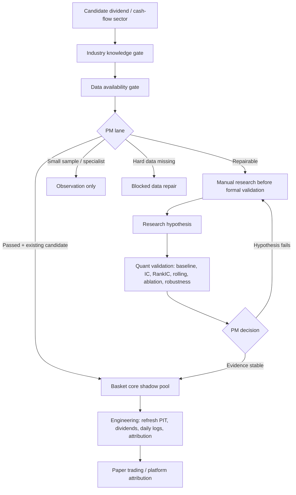

# V5.8 Dividend Low-Vol Cash-Flow Sector Replication Roadmap V1

Date: 2026-07-19

Owner:

```text
Project Manager Agent
```

Status:

```text
roadmap_active
stage_gate_packet_generated
not_new_sector_modeling
not_strategy_acceptance
```

## Objective

V5.8 turns the nearby-sector replication process into a reusable coverage system for the future enhanced basket:

```text
Dividend + low volatility + operating cash-flow strength,
with free cash flow only as a sector-approved enhancement after capex-quality review.
```

The current evidence does not support a basket-wide low-PB / raw-FCF mainline. V5.8 keeps the current V5.7f candidate frozen while expanding the industry coverage map.

## Factor Policy

| Role | Factor family | PM rule |
| --- | --- | --- |
| Primary cross-sector factors | OCF yield, low volatility | May be used across sleeves after PIT validation |
| Supporting factors | Dividend yield, dividend stability, cash-flow coverage | Must remain financially explainable |
| Sector-approved enhancements | FCF yield, capex quality, operating state | Must pass sector-specific accounting and business-cycle review |
| Not current mainline | Low PB as basket-wide core, raw FCF without capex review | Returned to Research / Quant, not accepted |

## Replication Flow



## Current PM Lanes

| Lane | Sectors | Owner | Rule |
| --- | --- | --- | --- |
| Basket core shadow pool | Bank, Utilities / Electricity, Highway Infrastructure, Port / Rail Infrastructure | Engineering Agent | Refresh data, paper signals and platform attribution only; no tuning |
| Manual research before formal | Gas / Water, Airport / Transport, Oil / Gas Pipeline, Consumer Staples, Pharma / Medical Services | Research Agent | Build knowledge, business purity, PIT field map and FCF/capex-quality gate first |
| Observation only | Telecom Operators, Insurance | Project Manager Agent | Requires small-sample or specialist-data policy before formal inclusion |
| Blocked data repair | Environmental / Project Operators, Coal | Research Agent | Repair hard data gates only; no modeling |

## Agent Instructions

Project Manager Agent:

- Keep V5.7f frozen.
- Route each sector by lane and stop at the correct stage gate.
- Produce checkpoint, blocker or failure-return packets instead of asking after every ordinary step.
- Ask the user only for new sector launches, strategy-state promotion, external paid/manual data decisions, frozen-logic changes or large irreversible engineering changes.

Research Agent:

- Learn industry business model, profit driver, risk variables and value traps before proposing factors.
- For each sector, define whether FCF is core, supporting, diagnostic or rejected.
- Return failed hypotheses with reasons and restart conditions.

Quant Validation Agent:

- Validate only PIT-safe hypotheses with baseline, IC/RankIC, rolling, ablation, robustness and weak-year analysis.
- Reject hypotheses without stable evidence, even if one backtest looks good.

Engineering Agent:

- Work on frozen candidates and data pipelines only.
- Generate PIT panels, daily open/close inputs, dividends, low-vol factors, basket signals, cash/holding/trade logs and platform-attribution packets.
- Do not alter research conclusions.

## Execution Artifacts

```text
config/dividend_low_vol_cashflow_sector_coverage_v58.json
roadmaps_v58_sector_replication/sector_replication_roadmap.csv
roadmaps_v58_sector_replication/sector_replication_roadmap_summary.json
roadmaps_v58_sector_replication/sector_replication_roadmap_pm_report.md
roadmaps_v58_sector_replication/agent_queues/project_manager_queue.csv
roadmaps_v58_sector_replication/agent_queues/research_agent_queue.csv
roadmaps_v58_sector_replication/agent_queues/quant_validation_agent_queue.csv
roadmaps_v58_sector_replication/agent_queues/engineering_agent_queue.csv
src/v5/sector_replication_roadmap_runner.py
tests/test_sector_replication_roadmap_runner.py
```

## PM Decision

V5.8 broad replication is active as a workflow layer. It does not approve any new sector model by itself.

Next operational queue:

1. Engineering Agent keeps core sleeves refreshed for platform attribution and paper trading.
2. Research Agent starts with Gas / Water, then Airport / Transport, then Oil / Gas Pipeline, Consumer Staples and Pharma / Medical Services.
3. Telecom and Insurance stay observation-only until PM approves a small-sample or specialist sleeve policy.
4. Coal and Environmental / Project Operators stay blocked until hard data gates are repaired.

## Hard Rule

Historical performance alone is never sufficient evidence for accepting a strategy.
