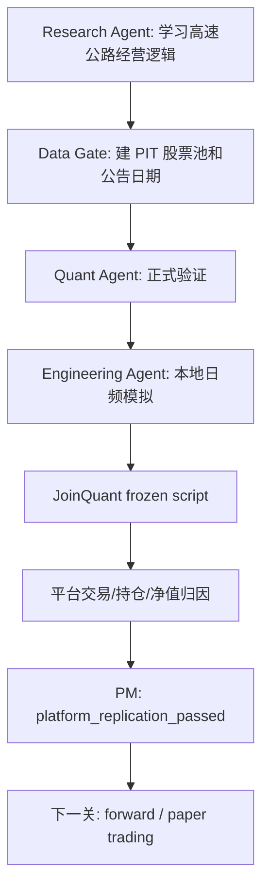

# Bank Quant V5.4 交通运输 / 高速公路阶段性汇报

日期：2026-07-18

策略 ID：`highway_dividend_reviewed_operating_v54h_repaired_2021`

当前状态：

```text
formal_strategy_candidate
research_pit_validation_repaired
platform_replication_passed
not_accepted_strategy
next_gate = forward / paper trading
```

## 一、核心结论

V5.4 交通运输基础设施 / 高速公路主线可以阶段性收口。

这次测试非常顺利，模式复制很成功。它证明 V5 的研究、PIT 数据、量化验证、本地模拟、聚宽复刻、平台归因这套流程，可以从银行、电力等板块复制到新的稳定现金流板块。

但治理结论仍然要严格区分：

- 它已经是 `formal_strategy_candidate`。
- 它已经通过 `platform_replication`。
- 它还不是 `accepted_strategy`。
- 下一关是 forward / paper trading。

本阶段最重要的成果不是“历史收益很好”，而是 V5 的完整研发流程在交通运输 / 高速公路板块跑通了。

## 二、这次 V5.4 测试的对象

测试板块：

```text
A 股交通运输基础设施，重点是高速公路 / 收费公路运营公司
```

核心逻辑：

```text
高股息 + 高速经营纯度 + 稳定现金流 + PIT 可见经营证据
```

需要特别说明：

这不是泛交通运输策略。航空、物流、港口、铁路、公交地铁等业务逻辑不同，不能和高速公路运营公司混在一个模型里直接验证。

V5.4 的实际成功点，是高速公路运营类资产和红利现金流框架匹配度较高。

## 三、流程复制结果



实际结果：

| 阶段 | 完成情况 | 说明 |
| --- | --- | --- |
| Research | 完成高速公路经营逻辑学习 | 没有把宽交通运输混成一个模型 |
| Data Gate | 修复 2020 年报 PIT 可见证据 | 解决 2021 年无交易问题 |
| Quant | 完成 PIT 审计、IC/RankIC、rolling、baseline、robustness | 没有只看历史收益 |
| Engineering | 完成本地日频模拟、分红、交易限制、聚宽脚本 | 策略能真实运行 |
| Platform | 完成聚宽收益、交易、持仓、净值归因 | 本地和聚宽口径可复刻 |
| PM | 标记正式候选，但不接受为最终策略 | 保持治理边界 |

## 四、PIT 数据修复

V5.4g 一开始在 2022-04-01 前没有交易。复查后确认：

```text
这不是交易代码故障，而是数据可见性问题。
```

原因是原来的 reviewed operating evidence 主要来自 2021 年报，而 2021 年报到 2022 年 3-4 月才可见。因此，2021 年 5 月回测开始时不能使用这些数据。

V5.4h 用 2020 年报中已经可见的高速经营证据修复早期股票池。

| 项目 | 结果 |
| --- | ---: |
| 2020 disclosure rows added | 40 |
| CNINFO annual reports requested | 120 |
| CNINFO annual reports downloaded | 96 |
| Operating candidate snippets | 5,563 |
| Operating shortlist rows | 1,553 |
| PIT usable reviewed operating rows | 69 |
| 2020 annual PIT usable reviewed operating rows | 11 |
| V5.4h formal panel rows | 193 |
| V5.4h formal rebalance dates | 21 |

这个修复很关键：它让 2021 年第一期信号在聚宽上正常买入。

## 五、正式验证结果

| 测试 | 结果 |
| --- | ---: |
| PIT leakage audit | pass |
| Date count | 21 |
| Equal-weight reviewed formal | 93.27% |
| High-dividend reviewed top8 | 91.94% |
| Composite current | 102.34% |
| Common-sample composite | 113.64% |
| Dividend yield mean IC | 0.1686 |
| Dividend yield mean RankIC | 0.1999 |

量化解释：

- 股息率仍然是最有金融解释力的主信号。
- 高速收入占比、非高速收入占比、经营披露质量更适合做股票池门槛和诊断变量。
- 这些经营变量暂时不应被解释为强独立 alpha。
- V5.4h 的价值在于把股票池变干净，而不是堆更多因子。

## 六、本地日频模拟结果

本地模拟使用接近聚宽的执行假设：

- 真实未复权日频价格。
- 日开盘价执行。
- 日收盘价估值。
- A 股 100 股整数手限制。
- 现金分红到账。
- 佣金和最低佣金。
- 停牌、涨停、跌停交易限制。

| 指标 | 结果 |
| --- | ---: |
| Signal count | 21 |
| First signal date | 2021-05-06 |
| Strategy return | 106.61% |
| Annualized return | 16.06% |
| Same-pool benchmark return | 58.10% |
| Excess return | 48.51% |
| Max drawdown | 14.91% |
| Sharpe | 0.936 |
| Information ratio | 0.654 |

本地结果说明：策略不仅在季度信号层面有效，也能在日频交易、现金、分红、持仓约束下运行。

## 七、聚宽平台复刻结果

| 项目 | 结果 |
| --- | ---: |
| Platform replication packet status | platform_replication_passed |
| JoinQuant strategy return | 104.26% |
| Local strategy return | 106.61% |
| Final strategy-return gap | 2.35 pct pts |
| Max absolute strategy-return gap | 2.38 pct pts |
| Matched daily NAV days | 1,228 |
| Rebalance dates checked | 21 |
| Rebalance-date code mismatch count | 0 |
| JoinQuant transaction rows | 162 |
| Local transaction rows | 169 |
| Matched transaction keys | 157 |

归因解释：

- 本地和聚宽的策略净值差异在可接受阈值内。
- 剩余差异主要来自本地日开盘价执行 vs 聚宽 09:40 市价成交。
- 聚宽显示基准 `000027.XSHG` 不是纯高速公路基准。
- 正式比较仍应使用本地高速同池等权基准。

因此，V5.4h 可以标记为：

```text
platform_replication_passed
```

## 八、发现并修复的问题

### 1. 2021 年无交易问题

问题：

V5.4g 在 2022-04-01 前没有交易。

原因：

早期 reviewed operating evidence 不可见，属于 PIT 数据覆盖问题。

修复：

使用 2020 年报中已经可见的高速经营证据，重建早期 PIT 股票池。

结果：

聚宽在 2021-05-06 正常买入。

### 2. 涨停无法买入

`000828.XSHE` 在 2024-10-08 被策略选中，但当天涨停，聚宽买单撤销。

本地也记录为：

```text
buy_skipped: high_limit
```

这不是策略错误，而是交易约束。

### 3. 平台归因工具修复

这次顺手修复了平台归因工具，使其支持：

- 聚宽 `--` 空值。
- 中文买 / 卖标签。
- 撤单 0 股订单。
- 本地 0 股 skipped holding。
- 聚宽卖出负数量的归一化比较。

这个修复对后续所有板块复刻都有用。

## 九、为什么交通运输这条线顺利

相比煤炭和保险，交通运输 / 高速公路更顺利，原因很清楚：

1. 经济逻辑更匹配红利现金流框架。
2. 高速公路公司现金流相对稳定。
3. 年报、分部收入、收费公路经营信息可以形成 PIT 证据。
4. 不需要像煤炭那样依赖复杂商品周期数据。
5. 板块边界清楚，避免了过度混合行业逻辑。

这说明 V5 的流程不是只能服务银行策略。只要行业具备清晰经济逻辑和可获得 PIT 数据，V5 可以复制。

## 十、治理决策

V5.4h 应标记为：

```text
formal_strategy_candidate
platform_replication_passed
```

不应标记为：

```text
accepted_strategy
live_trading_approved
return_tuning_allowed
```

原因：

2021-2026 是平台确认窗口，不是未来真实样本。任何策略都不能仅因为历史收益较高而被接受。

## 十一、下一步

1. 启动 V5.4h forward / paper trading 记录。
2. 冻结当前模型，不根据本次平台收益调参。
3. 每次未来调仓记录选股、因子、PIT 可见日期、交易约束和风险说明。
4. 将 V5.4h 纳入红利现金流候选组合观察池。
5. 与银行、电力、保险候选一起观察，逐步形成红利现金流增强组合。

## 十二、项目级总结

V5.4 交通运输 / 高速公路主线研发阶段结束。

它证明：

```text
V5 的 Research -> Quant Validation -> Engineering -> Platform Replication 流程，
可以在具备清晰经济逻辑和可用 PIT 数据的新板块中复制。
```

最终判断：

```text
交通运输 / 高速公路模式复制很成功。
策略进入 forward / paper trading 观察阶段。
```

