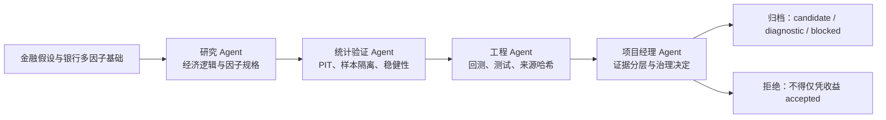

# V5 研究生申请项目简介

## 研究命题

V5 回答的不是“怎样找到最高历史收益的策略”，而是：能否把一个银行多因子价值投资思想，转化成可审计、可复现、可扩展且受统计纪律约束的量化研究系统？项目的金融科技贡献是 agent 分工、结构化策略规格与证据链；统计贡献是 PIT、样本隔离、共同样本比较、滚动/稳健性审计和拒绝机制。

## 从 V1-V4 到 V5

V1-V4 建立了银行多因子价值策略及其统计验证习惯。V5 将该过程系统化：项目经理决定研究顺序；研究 agent 将金融逻辑转成假设；统计 agent 负责 PIT、因子与样本审计；工程 agent 生成可运行代码、测试与结果包。人类负责最终研究判断，AI 不拥有策略接受权限。

## 数据与样本设计

- 训练/验证窗口：2013-01-01_to_2021-04-30。
- 冻结正式回测窗口：2021-05-01_to_2026-05-31。
- 2021-2026 不可用于因子发现、参数调优、滚动验证或独立验证。
- 唯一正式基线：`v57f_startup_preload_repaired_baseline`；首个有效信号日为 2021-05-06。

## 组合构建

个性化红利 ETF 式组合由银行、电力公用事业、高速基础设施和港口铁路基础设施四个核心 sleeve 构成。每个 sleeve 使用同一受约束研究流程，但允许金融机制决定行业内可用因子；组合层固定行业上限、单股上限、目标持仓数与调仓频率，防止跨行业事后调权。

## 正式可比结果的正确表述

唯一允许写入正式表现表的是 repaired baseline 与主候选 `internal_subsleeve_mom12_70_30` 的共同日样本比较：1228 个交易日，2021-05-06 至 2026-05-29。主候选历史总收益为 120.6867%，基线为 109.2546%；这只是 `validation_not_independent` 条件下的历史观察，绝非接受、部署或未来收益承诺。

## 评审应看到的能力

1. 将金融理论转为可检验策略假设。
2. 正确隔离研究窗与回测窗，并主动拒绝污染性结论。
3. 用 agent 分工和机器可读规格降低研究与工程混淆。
4. 用行业扩展和失败案例检验可迁移性，而不是只展示赢家。
5. 将现金、交易、平台一致性和数据不可得性纳入同一治理框架。
